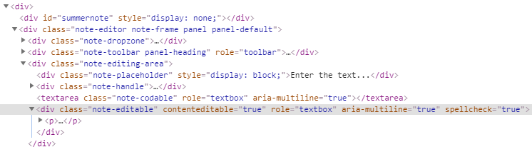

{{ page.description }}
{:.lead}

## Given

[The page under test](demo/) containing [Summernote](https://summernote.org/) WYSIWYG editor component
based on [contenteditable](https://developer.mozilla.org/en-US/docs/Web/HTML/Global_attributes/contenteditable) HTML attribute.

<div class="embed-responsive embed-responsive-150">
  <iframe class="embed-responsive-item" src="demo/"></iframe>
</div>

This example, for simplification, covers only interaction with the text editing area, without toolbar buttons.
{:.info}

## Implementation

### Define Control Definition

First of all you need to defined text exitor control's definition using browser dev tools.
You can, for example, search for `[contenteditable="true"]` element.



The `note-editable` class is unique and can be used to detect the editing area.

### Create Custom Control

You need to create a custom control for the specific text exitor.
Note that this example covers only interaction with text editing area, without toolbar buttons.

```cs
using Atata;

namespace SampleApp.UITests
{
    [ControlDefinition(ContainingClass = "note-editable", ComponentTypeName = "text editor")]
    public class SummernoteEditingArea<TOwner> : ContentEditor<TOwner>
        where TOwner : PageObject<TOwner>
    {
    }
}
```

The main thing needed is to inherit `ContentEditor<TOwner>`
that is created specifically for `contenteditable` components.

It is also possible to use `ContentEditor<TOwner>` directly.
{:.info}

### Use Custom Control

```cs
using Atata;

namespace SampleApp.UITests
{
    using _ = SomePage;

    public class SomePage : Page<_>
    {
        public SummernoteEditingArea<_> Editor { get; private set; }
    }
}
```
{:.page-object}

### Test

```cs
Go.To<SomePage>()
    .Editor.Set("Some text")
    .Editor.Should.Equal("Some text")
    .Editor.Set("Another text")
    .Editor.Should.Equal("Another text");
```
{:.test}