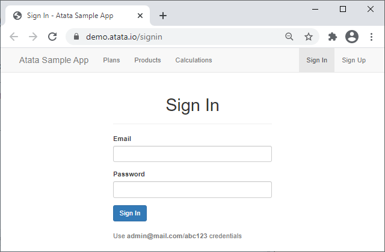
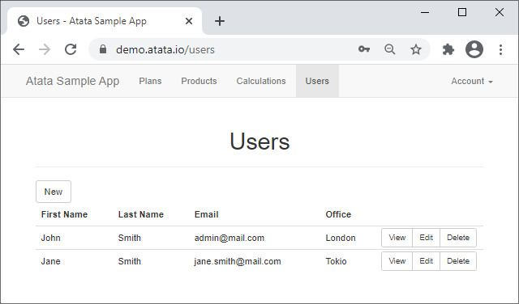
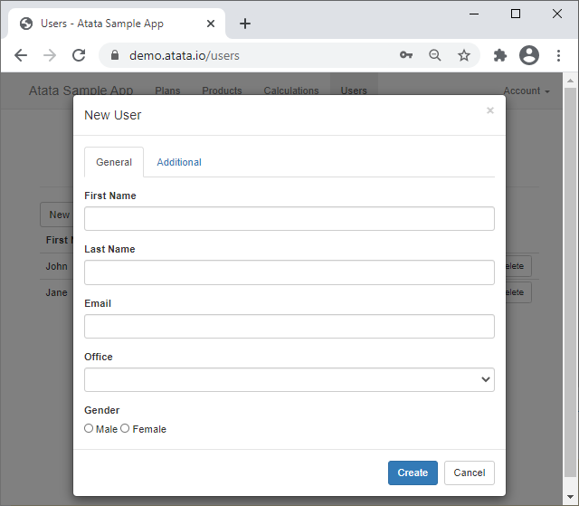
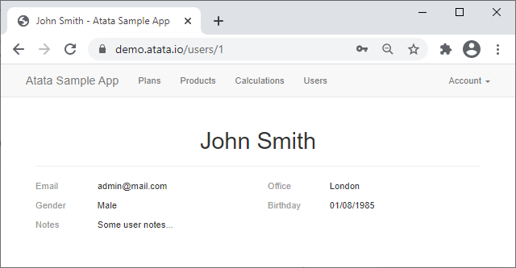

An introduction to Atata Framework and how to create a basic web UI test project with a workflow test.
{:.lead}




{{ download-section }}

## Introduction

In this tutorial, I would like to show the usage of the Atata Framework for web UI testing using the [Atata demo website](https://demo.atata.io/signin).
It is a simple website that contains the following:
"Sign In" page, "Users" page, "User Details" page and "User Create/Edit" window.

Let's try to implement an auto-test for the following test case:

1. Sign in on <https://demo.atata.io/signin> page.
1. Click "New" button on the user list page.
1. Create a new user by filling in the user fields.
1. Verify that the new user is present on the user list page.
1. Navigate to the user's details.
1. Verify the user's details correspond to the entered values.

## Create project

Create a new Atata NUnit basic test project using the [guide](/getting-started/#installation).

NUnit is not actually required, you can use any .NET testing framework like MSTest or xUnit together with Atata.
{:.info}

Additionally, add the Atata.Bootstrap NuGet package to the project, as the demo website uses Bootstrap components.

## Sign in page

Any web page can be represented with a page object.
To start, we need to implement a page object class for "Sign In" page.



`SignInPage.cs`
{:.file-name}

```cs
namespace SampleApp.UITests;

using _ = SignInPage;

[Url("signin")]
[VerifyTitle]
[VerifyH1]
public sealed class SignInPage : Page<_>
{
    public TextInput<_> Email { get; private set; }

    public PasswordInput<_> Password { get; private set; }

    public Button<UsersPage, _> SignIn { get; private set; }
}
```

In Atata, you operate with controls, rather than `IWebElement`'s.
A page object consists of controls.
Any control like `TextInput` wraps `IWebElement` and has its own set of methods and properties for element interaction.
Find out more about the [components](/components/) in the documentation.

Please note the 3rd line of the above code:

```cs
using _ = SignInPage;
```

It is made to simplify the use of class type for declaration of controls,
as every control has to know its owner page object (specify single or last generic argument).
It's just syntactic sugar and, of course, you can declare the controls this way:

```cs
public TextInput<SignInPage> Email { get; private set; }
```

`SignIn` button, as you can see, is defined with 2 generic arguments:
the first one is the type of the page object to navigate to, after the button is clicked;
the other one is the owner type.
For buttons and links that don't perform any navigation, just pass a single generic argument, the owner page object.

It is possible to mark properties with attributes to specify a finding approach (e.g. `[FindById]`, `[FindByName]`).
In current case, it is not required, as the default search for inputs is `FindByLabel` and for buttons is `FindByContentOrValue`,
and that suits our needs.
Find out more about the [control search](/control-search/) in the documentation.

There is also `[Url]` attribute, which specifies relative (can be absolute) URL of this page.
It can be used when you navigate to the page object.

`[VerifyTitle]` and `[VerifyH1]` are the triggers that, in the current case,
are executed upon the page object initialization (after the navigation to the page).
If the string value is not passed to these attributes, they use class name without the "Page" ending in title casing.
For instance, `SignInPage` -> `"Sign In"`.
It can be totally configured.
Find out more about the [triggers](/triggers/) in the documentation.

## Users page



The "Users" page contains a table of users with CRUD actions.

`UsersPage.cs`
{:.file-name}

```cs
namespace SampleApp.UITests;

using _ = UsersPage;

[VerifyTitle]
[VerifyH1]
public sealed class UsersPage : Page<_>
{
    public Button<UserEditWindow, _> New { get; private set; }

    public Table<UserTableRow, _> Users { get; private set; }

    public sealed class UserTableRow : TableRow<_>
    {
        public Text<_> FirstName { get; private set; }

        public Text<_> LastName { get; private set; }

        public Text<_> Email { get; private set; }

        public Content<Office, _> Office { get; private set; }

        public Link<UserDetailsPage, _> View { get; private set; }

        public Button<UserEditWindow, _> Edit { get; private set; }

        [CloseConfirmBox]
        public Button<_> Delete { get; private set; }
    }
}
```

In the `UsersPage` class, you can see a use of `Table<TRow, TOwner>` and `TableRow<TOwner>` controls.
In `UserTableRow` class, the properties of type `Text` and `Content` by default are being searched by a column header (`FindByColumnHeader` attribute).
It can also be configured.
For example, the `FirstName` control will contain `"John"` value for the first row.
The usage of the table will be shown in the test method below.

Delete button is marked with `[CloseConfirmBox]` trigger,
which accepts a confirmation window shown after a click on the button.

## User create/edit window



It is quite a simple Bootstrap Framework popup window with two tabs and regular input controls.

`UserEditWindow.cs`
{:.file-name}

```cs
namespace SampleApp.UITests;

using _ = UserEditWindow;

public sealed class UserEditWindow : BSModal<_>
{
    [FindById]
    public GeneralTabPane General { get; private set; }

    [FindById]
    public AdditionalTabPane Additional { get; private set; }

    [Term("Save", "Create")]
    public Button<UsersPage, _> Save { get; private set; }

    [TypesTextUsingScript(TargetType = typeof(EditableTextField<,>))]
    public sealed class GeneralTabPane : BSTabPane<_>
    {
        public TextInput<_> FirstName { get; private set; }

        public TextInput<_> LastName { get; private set; }

        [RandomizeStringSettings("{0}@mail.com")]
        public TextInput<_> Email { get; private set; }

        public Select<Office?, _> Office { get; private set; }

        [FindByName]
        public RadioButtonList<Gender?, _> Gender { get; private set; }
    }

    public sealed class AdditionalTabPane : BSTabPane<_>
    {
        public DateInput<_> Birthday { get; private set; }

        public TextArea<_> Notes { get; private set; }
    }
}
```

The `UserEditWindow` is inherited from `BSModal<TOwner>` page object class.
It is a component of Atata.Bootstrap package.

`Save` button is marked with `[Term("Save", "Create")]` attribute that specifies the values for the control search.
It means that the button should be found by `"Save"` or `"Create"` text content.
Alternatively, you could achieve the same using more explicit `[FindByContent("Save", "Create")]` attribute.

`Gender` and `Office` controls use the following enums:

`Gender.cs`
{:.file-name}

```cs
namespace SampleApp.UITests;

public enum Gender
{
    Male,
    Female
}
```

`Office.cs`
{:.file-name}

```cs
namespace SampleApp.UITests;

public enum Office
{
    Berlin,
    London,
    NewYork,
    Paris,
    Rome,
    Tokio,
    Washington
}
```

## User details page



`UserDetailsPage.cs`
{:.file-name}

```cs
namespace SampleApp.UITests;

using _ = UserDetailsPage;

public sealed class UserDetailsPage : Page<_>
{
    [FindFirst]
    public H1<_> Header { get; private set; }

    [FindByDescriptionTerm]
    public Text<_> Email { get; private set; }

    [FindByDescriptionTerm]
    public Content<Office, _> Office { get; private set; }

    [FindByDescriptionTerm]
    public Content<Gender, _> Gender { get; private set; }

    [FindByDescriptionTerm]
    public Content<DateTime?, _> Birthday { get; private set; }

    [FindByDescriptionTerm]
    public Text<_> Notes { get; private set; }
}
```

## Atata setup

The main place to configure Atata is a global fixture.
Such fixture class should be typically inherited from `AtataGlobalFixture` (located in Atata.NUnit library).

`GlobalFixture.cs`
{:.file-name}

```cs
namespace SampleApp.UITests;

public sealed class GlobalFixture : AtataGlobalFixture
{
    protected override void ConfigureAtataContextBaseConfiguration(AtataContextBuilder builder)
    {
        builder.Sessions.AddWebDriver(x => x
            .UseStartScopes(AtataContextScopes.Test)
            .UseChrome(x => x
                .WithArguments(
                    "start-maximized",
                    "disable-search-engine-choice-screen"))
            .UseBaseUrl("https://demo.atata.io/"));

        builder.Attributes.Global.Add(
            new VerifyTitleSettingsAttribute { Format = "{0} - Atata Sample App" });
    }

    protected override void ConfigureGlobalAtataContext(AtataContextBuilder builder) =>
        builder.SetUpWebDriversForUse();
}
```

Here we globally configure the following:

1. Add a web driver session for the test scope. It means starting such session before each test and tearing it down after test.
1. Tell to use Chrome browser.
1. Set the base site URL.
1. Set format of the page title, as all the pages on the testing website have a page title like "* - Atata Sample App".
1. `SetUpWebDriversForUse` sets up a driver for the browser that we want to use, which is *chromedriver.exe* in this case. Atata.WebDriverSetup package is responsible for that.

For more configuration options, please check the [Getting Started / Configuration](/getting-started/#configuration) page in the documentation.

## Base test suite class

In order Atata to integrate with NUnit, we need to inherit our test suite classes from `AtataTestSuite` class.

Optionally, we can create our base test suite class, which will hold common functionality.
It should then be inherited from `AtataTestSuite`.
Other test suites will inherit such base class.

Let's create a base test suite class named `TestSuite` and put `Login` method there.

`TestSuite.cs`
{:.file-name}

```cs
namespace SampleApp.UITests;

public abstract class TestSuite : AtataTestSuite
{
    protected static UsersPage Login() =>
        Go.To<SignInPage>()
            .Email.Set("admin@mail.com")
            .Password.Set("abc123")
            .SignIn.ClickAndGo();
}
```

As you can see in `Login` method, navigation starts from `Go` static class.
To keep the example simple, we use hard-coded credentials here, that can easily be moved to a configuration file, for example.

## User test

And finally, the test that will use all of the created above classes and enums.

`UserTests.cs`
{:.file-name}

```cs
namespace SampleApp.UITests;

public sealed class UserTests : TestSuite
{
    [Test]
    public void Create() =>
        Login() // Returns UsersPage.
            .New.ClickAndGo() // Returns UserEditWindow.
                .ModalTitle.Should.Be("New User")
                .General.FirstName.SetRandom(out string firstName)
                .General.LastName.SetRandom(out string lastName)
                .General.Email.SetRandom(out string email)
                .General.Office.SetRandom(out Office office)
                .General.Gender.SetRandom(out Gender gender)
                .Save.ClickAndGo() // Returns UsersPage.
            .Users.Rows[x => x.Email == email].View.ClickAndGo() // Returns UserDetailsPage.
                .AggregateAssert(page => page
                    .Header.Should.Be($"{firstName} {lastName}")
                    .Email.Should.Be(email)
                    .Office.Should.Be(office)
                    .Gender.Should.Be(gender)
                    .Birthday.Should.Not.BePresent()
                    .Notes.Should.Not.BePresent());
}
```

I prefer to use fluent page object pattern in the Atata tests.
If you don't like such approach, use without fluent pattern.

You can use random or predefined values in the test, as you like.

The assertion starts with `Should` property.
There is a set of extension methods for different controls and values like:
`Be`, `BePresent`, `BeVisible`, `StartWith`, `BeGreater`, `BeEnabled`, `HaveChecked`, etc.

That's all. Build project, run test and verify how it works.

## Logging

Atata can generate log to different sources.
As we use integration with NUnit, Atata will automatically by default write logs to NUnit test context.
You can also use Atata.NLog package to write logs to files.

Here is a part of the test log:

```
00:00:00.000 vvty DEBUG Starting test SampleApp.UITests.UserTests.Create at 2026-08-07 19:28:04.086
00:00:00.000 vvty TRACE > Initialize AtataContext { Id=vvty }
00:00:00.000 vvty TRACE - Set: Artifacts=D:\dev\atata-samples\SampleApp.UITests\SampleApp.UITests\bin\Debug\net10.0\artifacts\20260807T192803\UserTests\Create
00:00:00.007 4LTD TRACE - > Initialize WebDriverSession { Id=4LTD }
00:00:00.011 4LTD TRACE - - Set: BaseUrl=https://demo.atata.io/
00:00:00.012 4LTD TRACE - - Set: ElementFindTimeout=5s; ElementFindRetryInterval=0.2s
00:00:00.012 4LTD TRACE - - Set: WaitingTimeout=5s; WaitingRetryInterval=0.2s
00:00:00.012 4LTD TRACE - - Set: VerificationTimeout=5s; VerificationRetryInterval=0.2s
00:00:00.013 4LTD TRACE - - > Initialize Driver
00:00:00.017 4LTD TRACE - - - Created ChromeDriverService { Port=49197, ExecutablePath=D:\dev\atata-samples\SampleApp.UITests\SampleApp.UITests\bin\Debug\net10.0\drivers\chrome\151.0.7922.77\chromedriver.exe }
00:00:00.708 4LTD TRACE - - - Created ChromeDriver { Alias=chrome, SessionId=cbc489e82de69bfb5f0f5dd2a855f6c7 }
00:00:00.709 4LTD TRACE - - < Initialize Driver (0.696s)
00:00:00.710 4LTD TRACE - < Initialize WebDriverSession { Id=4LTD } (0.702s)
00:00:00.711 vvty TRACE < Initialize AtataContext { Id=vvty } (0.711s)
00:00:00.752 4LTD  INFO > Go to "Sign In" page by URL https://demo.atata.io/signin
00:00:01.204 4LTD  INFO < Go to "Sign In" page by URL https://demo.atata.io/signin (0.451s)
00:00:01.215 4LTD TRACE > Execute trigger VerifyTitleAttribute { Case=Title, Match=Equals, Timeout=5, RetryInterval=0.2 } on Init against "Sign In" page
00:00:01.225 4LTD  INFO - > Assert: title should equal "Sign In - Atata Sample App"
00:00:01.233 4LTD  INFO - < Assert: title should equal "Sign In - Atata Sample App" (0.007s)
00:00:01.233 4LTD TRACE < Execute trigger VerifyTitleAttribute { Case=Title, Match=Equals, Timeout=5, RetryInterval=0.2 } on Init against "Sign In" page (0.017s)
00:00:01.233 4LTD TRACE > Execute trigger VerifyH1Attribute { Index=-1, Case=Title, Match=Equals, Timeout=5, RetryInterval=0.2 } on Init against "Sign In" page
00:00:01.240 4LTD  INFO - > Assert: "Sign In" <h1> heading should be present
00:00:01.255 4LTD TRACE - - > Find visible element by XPath ".//h1[normalize-space(.) = 'Sign In']" in ChromeDriver
00:00:01.275 4LTD TRACE - - < Find visible element by XPath ".//h1[normalize-space(.) = 'Sign In']" in ChromeDriver (0.019s) >> Element (id = f.5DF809175A1C44DDF5EAA8CEE00E023C.d.21CE20DFA184A481EEC8E720C99B784B.e.6)
00:00:01.276 4LTD  INFO - < Assert: "Sign In" <h1> heading should be present (0.035s)
00:00:01.276 4LTD TRACE < Execute trigger VerifyH1Attribute { Index=-1, Case=Title, Match=Equals, Timeout=5, RetryInterval=0.2 } on Init against "Sign In" page (0.042s)
00:00:01.280 4LTD  INFO > Set "admin@mail.com" to "Email" text input
00:00:01.282 4LTD TRACE - > Execute behavior SetsValueUsingClearAndTypeBehaviorsAttribute against "Email" text input
00:00:01.284 4LTD TRACE - - > Execute behavior ClearsValueUsingClearMethodAttribute against "Email" text input
00:00:01.288 4LTD TRACE - - - > Find element by XPath "(.//*[@id = //label[normalize-space(.) = 'Email']/@for]/descendant-or-self::input[@type='text' or not(@type)] | .//label[normalize-space(.) = 'Email']/descendant-or-self::input[@type='text' or not(@type)])" in ChromeDriver
00:00:01.296 4LTD TRACE - - - < Find element by XPath "(.//*[@id = //label[normalize-space(.) = 'Email']/@for]/descendant-or-self::input[@type='text' or not(@type)] | .//label[normalize-space(.) = 'Email']/descendant-or-self::input[@type='text' or not(@type)])" in ChromeDriver (0.008s) >> Element (id = f.5DF809175A1C44DDF5EAA8CEE00E023C.d.21CE20DFA184A481EEC8E720C99B784B.e.5)
00:00:01.297 4LTD TRACE - - - > Clear element (id = f.5DF809175A1C44DDF5EAA8CEE00E023C.d.21CE20DFA184A481EEC8E720C99B784B.e.5)
00:00:01.316 4LTD TRACE - - - < Clear element (id = f.5DF809175A1C44DDF5EAA8CEE00E023C.d.21CE20DFA184A481EEC8E720C99B784B.e.5) (0.019s)
00:00:01.317 4LTD TRACE - - < Execute behavior ClearsValueUsingClearMethodAttribute against "Email" text input (0.032s)
00:00:01.317 4LTD TRACE - - > Execute behavior TypesTextUsingSendKeysAttribute against "Email" text input
00:00:01.318 4LTD TRACE - - - > Send keys "admin@mail.com" to element (id = f.5DF809175A1C44DDF5EAA8CEE00E023C.d.21CE20DFA184A481EEC8E720C99B784B.e.5)
00:00:01.365 4LTD TRACE - - - < Send keys "admin@mail.com" to element (id = f.5DF809175A1C44DDF5EAA8CEE00E023C.d.21CE20DFA184A481EEC8E720C99B784B.e.5) (0.045s)
00:00:01.365 4LTD TRACE - - < Execute behavior TypesTextUsingSendKeysAttribute against "Email" text input (0.047s)
00:00:01.365 4LTD TRACE - < Execute behavior SetsValueUsingClearAndTypeBehaviorsAttribute against "Email" text input (0.082s)
00:00:01.365 4LTD  INFO < Set "admin@mail.com" to "Email" text input (0.084s)

...

00:00:02.839 vvty TRACE > Deinitialize AtataContext { Id=vvty }
00:00:02.843 4LTD TRACE - > Deinitialize WebDriverSession { Id=4LTD }
00:00:02.954 4LTD TRACE - < Deinitialize WebDriverSession { Id=4LTD } (0.111s)
00:00:02.956 vvty TRACE < Deinitialize AtataContext { Id=vvty } (0.116s)
00:00:02.959 vvty DEBUG Finished test with passed status at 2026-08-07 19:28:07.045
      Total time: 2.957s
  Initialization: 0.712s | 24.1 %
       Test body: 2.127s | 71.9 %
Deinitialization: 0.116s |  4.0 %
```

Log entries are written in the following format by default:
"{time elapsed} {level} {context/session ID} {message} {exception}"

{{ download-section }}