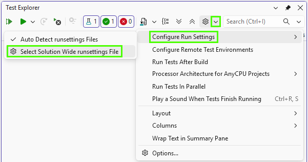

How to configure multi-environment tests application using environment variables, *.json* and *.runsettings* files.
{:.lead}




{{ download-section }}

## Prerequisites

Create a new Atata NUnit basic test project using the [guide](/getting-started/#installation).

## Introduction

Let's say you have a tests application that should be run against different environments, e.g. local, QA, staging.

As the key parameter, which specifies the test environment, we'll use `TestEnvironment`, which can have values like "local", "qa", "staging".

Parameters that configure each environment are:

- `BaseUrl` - the base URL of the application under test.
- `AccountEmail` - email of the account to use for login.
- `AccountPassword` - password of the account to use for login.
- `WebDriverAlias` - the name of the web browser driver alias to use in tests, e.g. "chrome-headed", "chrome-headless".

We want all parameters to be configured/overridden using environment variables.

In *.runsettings* files we'll specify only the main parameters of tests application, such as `TestEnvironment` and `WebDriverAlias`.
Other configuration parameters we'll configure in *.json* configuration files.

The NuGet packages needed to be added to the project are:

- 
- 
- 

You might not need to configure both *.runsettings* and *.json* files for your project.
It depends on your needs and preferences.
It can be easier or even more complex.
At the beginning using *.runsettings* with environment variables can be enough.
The goal of the tutorial is to show how to use different configuration approaches together.
{:.warning}

## Environment variables

As a primary way to configure multi-environment tests application, environment variables can be used.
Environment variables can be set on the machine, in CI pipelines, as well as in *.runsettings* files.

## *.runsettings* files

You can configure *.runsettings* files for each environment you need.
For this tutorial let's configure 3 *.runsettings* files.

Find out more information on *.runsettings* file and how to use it in Visual Studio on
[Configure unit tests by using a *.runsettings* file](https://learn.microsoft.com/en-us/visualstudio/test/configure-unit-tests-by-using-a-dot-runsettings-file?view=visualstudio) article.
{:.info}

`local.runsettings`
{:.file-name}

```xml
<?xml version="1.0" encoding="utf-8"?>
<RunSettings>
  <RunConfiguration>
    <EnvironmentVariables>
      <TestEnvironment>local</TestEnvironment>
      <WebDriverAlias>chrome-headed</WebDriverAlias>
    </EnvironmentVariables>
  </RunConfiguration>
</RunSettings>
```

`qa.runsettings`
{:.file-name}

```xml
<?xml version="1.0" encoding="utf-8"?>
<RunSettings>
  <RunConfiguration>
    <EnvironmentVariables>
      <TestEnvironment>qa</TestEnvironment>
      <WebDriverAlias>chrome-headless</WebDriverAlias>
    </EnvironmentVariables>
  </RunConfiguration>
</RunSettings>
```

`staging.runsettings`
{:.file-name}

```xml
<?xml version="1.0" encoding="utf-8"?>
<RunSettings>
  <RunConfiguration>
    <EnvironmentVariables>
      <TestEnvironment>staging</TestEnvironment>
      <WebDriverAlias>chrome-headless</WebDriverAlias>
    </EnvironmentVariables>
  </RunConfiguration>
</RunSettings>
```

## *.json* configuration files

`config.local.json`
{:.file-name}

```json
{
  "baseUrl": "https://localhost:4404/",
  "accountEmail": "local.user@mail.com",
  "accountPassword": "abc123"
}
```

`config.qa.json`
{:.file-name}

```json
{
  "baseUrl": "https://qa.example.org/",
  "accountEmail": "qa.user@mail.com",
  "accountPassword": "qapass"
}
```

`config.staging.json`
{:.file-name}

```json
{
  "baseUrl": "https://staging.example.org/",
  "accountEmail": "staging.user@mail.com",
  "accountPassword": "stagingpass"
}
```

## Configuration classes

You can define configuration class(es) to bind configuration parameters to these classes.

For a simple configuration, you can define only one class with all parameters and name it `GlobalConfig`.

`GlobalConfig.cs`
{:.file-name}

```cs
namespace AtataSamples.Configuration.MultiEnvViaRunSettingsAndJson;

public sealed class GlobalConfig
{
    public required string BaseUrl { get; init; }

    public required string AccountEmail { get; init; }

    public required string AccountPassword { get; init; }

    public required string WebDriverAlias { get; init; } = "chrome-headed";
}
```

You can also set default values for parameters in the configuration class, like for `WebDriverAlias`,
which will be used if these parameters are not specified in environment variables, *.runsettings*, *.json*, etc.

## Global fixture

`GlobalFixture` class is a good place to read and apply configuration.

`GlobalFixture.cs`
{:.file-name}

```cs
using Microsoft.Extensions.Configuration;

namespace AtataSamples.Configuration.MultiEnvViaRunSettingsAndJson;

public sealed class GlobalFixture : AtataGlobalFixture
{
    private GlobalConfig? _config;

    protected override void OnBeforeGlobalSetup()
    {
        string testEnvironment = Environment.GetEnvironmentVariable("TestEnvironment") ?? "local";

        var configuration = new ConfigurationBuilder()
            .AddJsonFile($"config.{testEnvironment}.json")
            .AddEnvironmentVariables()
            .Build();

        _config = configuration.Get<GlobalConfig>();
    }

    protected override void ConfigureAtataContextBaseConfiguration(AtataContextBuilder builder)
    {
        builder.Sessions.AddWebDriver(x => x
            .UseStartScopes(AtataContextScopes.Test)
            .ConfigureChrome("chrome-headed", x => x
                .WithArguments(
                    "start-maximized",
                    "disable-search-engine-choice-screen")
                .WithArtifactsAsDownloadDirectory())
            .ConfigureChrome("chrome-headless", x => x
                .WithArguments(
                    "headless=new",
                    "window-size=1920,1080",
                    "disable-search-engine-choice-screen")
                .WithArtifactsAsDownloadDirectory())
            .UseDriver(_config!.WebDriverAlias)
            .UseBaseUrl(_config!.BaseUrl));

        builder.LogConsumers.AddNLogFile();
    }

    protected override void ConfigureGlobalAtataContext(AtataContextBuilder builder)
    {
        builder.UseState(_config);

        builder.SetUpWebDriversForUse();
    }
}
```

## Usage in test suites

Because `GlobalConfig` instance is added to state of a global `AtataContext` in `GlobalFixture.ConfigureGlobalAtataContext` method,
you can access `GlobalConfig` instance from any test suite class by calling:

```cs
Context.State.Get<GlobalConfig>();
```

This is optional, but you can create a base test suite class for easier access to configuration properties.

`TestSuite.cs`
{:.file-name}

```cs
namespace AtataSamples.Configuration.MultiEnvViaRunSettingsAndJson;

public abstract class TestSuite : AtataTestSuite
{
    protected GlobalConfig Config =>
        Context.State.Get<GlobalConfig>();
}
```

Then after you inherit your test suites from this base class, you'll be able to access configuration properties via `Config` property.

`SignInTests.cs`
{:.file-name}

```cs
namespace AtataSamples.Configuration.MultiEnvViaRunSettingsAndJson;

public sealed class SignInTests : TestSuite
{
    [Test]
    public void SignIn() =>
        Go.To<HomePage>()
            .SignIn.ClickAndGo()
                .Email.Set(Config.AccountEmail)
                .Password.Set(Config.AccountPassword);
}
```

## Usage outside of test suites

If you need to access configuration from any class, outside of test suites, you can do it this way:

```cs
AtataContext.ResolveCurrent().State.Get<GlobalConfig>();
```

## Select *.runsettings* file in Visual Studio

To select/switch current *.runsettings* file in Visual Studio:



## Specify *.runsettings* file in CI/CD

In order to run tests on CI using concrete browser, use `-s` parameter of `dotnet test` command to specify a *.runsettings* file.

```ps
dotnet test ./AtataSamples.Configuration.MultiEnvViaRunSettingsAndJson.csproj -s local.runsettings
```

{{ download-section }}