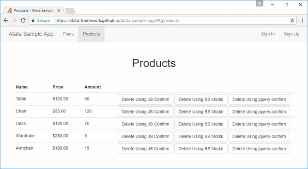
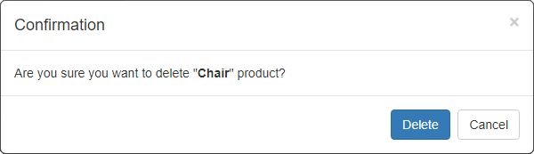
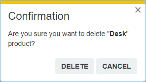

{{ page.description }}
{:.lead}




{{ download-section }}





## Introduction

In this tutorial, I would like to show how to easily handle confirmation popups using Atata Framework.
Tests application will handle: JS confirm, Bootstrap modal and jQuery Confirm box.
The ideas, covered in the article, can be applied to any other kinds of popups.

## Page Under Test

For testing purposes of this tutorial, the following test page is used: <https://demo.atata.io/products>.



The page contains a table of items.
Each item has 3 different delete buttons that confirm deletion via appropriate popups:
[JS confirm]({{ js_confirm_url }}),
[Bootstrap modal]({{ bs_modal_url }}) and
[jquery-confirm]({{ jq_confirm_url }}).

## Set Up Test Project

### Create Project

First of all, let's create a project for tests (e.g., named "AtataSamples.ConfirmationPopups").
In Visual Studio create a project for Atata automated testing using the [guide](/getting-started/#installation).

### Reference Atata.Bootstrap

Add a reference to  NuGet package.
It contains [`BSModal<TOwner>`](https://github.com/atata-framework/atata-bootstrap/blob/main/src/Atata.Bootstrap/BSModal%601.cs) component that will be needed later.

## JS Confirm

Let's start with the simplest [JS confirm]({{ js_confirm_url }}) popup.
It's being used rarely nowadays, but anyway it can be met on the web.

Create `ProductsPage` page object class.
Define the table with specific `ProductTableRow` sub-class, which describes product item row.

`ProductsPage.cs`
{:.file-name}

```cs
using Atata;

namespace AtataSamples.ConfirmationPopups;

using _ = ProductsPage;

[Url("products")]
public class ProductsPage : Page<_>
{
    public Table<ProductTableRow, _> Products { get; private set; }

    public class ProductTableRow : TableRow<_>
    {
        public Text<_> Name { get; private set; }

        public Currency<_> Price { get; private set; }

        public Number<_> Amount { get; private set; }

        [CloseConfirmBox]
        public ButtonDelegate<_> DeleteUsingJSConfirm { get; private set; }
    }
}
```

The popup closing functionality is bound to `DeleteUsingJSConfirm` button with `[CloseConfirmBox]` Atata attribute which does the magic.
Check [`CloseConfirmBoxAttribute`](https://github.com/atata-framework/atata/blob/main/src/Atata/Attributes/Triggers/CloseConfirmBoxAttribute.cs) sources if you are interested in what is going on behind the scene.

Create `ProductTests` test class inherited from `UITestFixture` with the test:

`ProductTests.cs`
{:.file-name}

```cs
using Atata;
using NUnit.Framework;

namespace AtataSamples.ConfirmationPopups;

public class ProductTests : UITestFixture
{
    [Test]
    public void DeleteUsingJSConfirm() =>
        Go.To<ProductsPage>()
            .Products.Rows.Count.Get(out int count)

            .Products.Rows[x => x.Name == "Table"].DeleteUsingJSConfirm()
            .Products.Rows[x => x.Name == "Table"].Should.Not.BePresent()
            .Products.Rows.Count.Should.Equal(count - 1);
}
```

The test does:

1. Records products count to a variable.
1. Deletes product with confirmation.
1. Verifies that the product does not exist any more in the list.
1. Verifies products count to be less by one.

## Bootstrap Modal

Now let's get to [Bootstrap modal]({{ bs_modal_url }}) confirmation popup.



Create `DeletionConfirmationBSModal<TNavigateTo>` page object class inherited from `BSModal<TOwner>` (defined in `Atata.Bootstrap` package).
`TNavigateTo` is a type of parent page object, where to navigate to after the popup is closed.

``DeletionConfirmationBSModal`1.cs``
{:.file-name}

```cs
using Atata;
using Atata.Bootstrap;

namespace AtataSamples.ConfirmationPopups;

[Name("Deletion Confirmation")]
[WindowTitle("Confirmation")]
public class DeletionConfirmationBSModal<TNavigateTo> : BSModal<DeletionConfirmationBSModal<TNavigateTo>>
    where TNavigateTo : PageObject<TNavigateTo>
{
    public ButtonDelegate<TNavigateTo, DeletionConfirmationBSModal<TNavigateTo>> Delete { get; private set; }

    public ButtonDelegate<TNavigateTo, DeletionConfirmationBSModal<TNavigateTo>> Cancel { get; private set; }
}
```

Add property to `ProductTableRow`:

```cs
public class ProductTableRow : TableRow<_>
{
    //...

    [FindByContent("Delete Using BS Modal")]
    public ButtonDelegate<DeletionConfirmationBSModal<_>, _> DeleteUsingBSModal { get; private set; }
}
```

In `ProductTests` class implement test:

```cs
[Test]
public void DeleteUsingBSModal() =>
    Go.To<ProductsPage>()
        .Products.Rows.Count.Get(out int count)

        .Products.Rows[x => x.Name == "Chair"].DeleteUsingBSModal()
            .Cancel() // Cancel and verify that nothing is deleted.
        .Products.Rows[x => x.Name == "Chair"].Should.BePresent()
        .Products.Rows.Count.Should.Equal(count)

        .Products.Rows[x => x.Name == "Chair"].DeleteUsingBSModal()
            .Delete() // Delete and verify that item is deleted.
        .Products.Rows[x => x.Name == "Chair"].Should.Not.BePresent()
        .Products.Rows.Count.Should.Equal(count - 1);
```

The test does:

1. Records products count to a variable.
1. Tries to delete product and clicks 'Cancel'.
1. Verifies that the product still exists.
1. Tries to delete product and clicks 'Delete'.
1. Verifies that the product does not exist any more in the list.
1. Verifies products count to be less by one.

### Handle Bootstrap Modal via Trigger

Another option to close simple popups is to use a custom trigger. Let's create one.

`ConfirmDeletionViaBSModalAttribute.cs`
{:.file-name}

```cs
using Atata;

namespace AtataSamples.ConfirmationPopups;

public class ConfirmDeletionViaBSModalAttribute : TriggerAttribute
{
    public ConfirmDeletionViaBSModalAttribute(TriggerEvents on = TriggerEvents.AfterClick, TriggerPriority priority = TriggerPriority.Medium)
        : base(on, priority)
    {
    }

    protected override void Execute<TOwner>(TriggerContext<TOwner> context) =>
        Go.To<DeletionConfirmationBSModal<TOwner>>(temporarily: true)
            .Delete();
}
```

The trigger, after the button is clicked, navigates to deletion confirmation modal and clicks 'Delete'.

Now we need to bind this trigger to button.
Add property to `ProductTableRow`:

```cs
public class ProductTableRow : TableRow<_>
{
    //...
    
    [FindByContent("Delete Using BS Modal")]
    [ConfirmDeletionViaBSModal]
    public ButtonDelegate<_> DeleteUsingBSModalViaTrigger { get; private set; }
}
```

Then implement test:

```cs
[Test]
public void DeleteUsingBSModal_ViaTrigger() =>
    Go.To<ProductsPage>()
        .Products.Rows.Count.Get(out int count)

        .Products.Rows[x => x.Name == "Chair"].DeleteUsingBSModalViaTrigger()
        .Products.Rows[x => x.Name == "Chair"].Should.Not.BePresent()
        .Products.Rows.Count.Should.Equal(count - 1);
```

The approach with trigger is easy to use, as you just invoke a method (e.g. `DeleteUsingBSModalViaTrigger`) and popup is confirmed behind the scene.

## JQuery Confirm

And finally [jquery-confirm]({{ jq_confirm_url }}).



We need to check the HTML of confirmation popup using browser developer tools.
Here is the simplified HTML of it:

```html
<div class="jconfirm-box jconfirm-hilight-shake jconfirm-type-orange jconfirm-type-animated" role="dialog">
    <div class="jconfirm-closeIcon" style="display: block;">×</div>
    <div class="jconfirm-title-c">
        <span class="jconfirm-icon-c"/>
        <span class="jconfirm-title">Confirmation</span>
    </div>
    <div class="jconfirm-content-pane">
        <div class="jconfirm-content" id="jconfirm-box52328">Are you sure you want to delete "<strong>Table</strong>" product?</div>
    </div>
    <div class="jconfirm-buttons">
        <button type="button" class="btn btn-default">delete</button>
        <button type="button" class="btn btn-default">cancel</button>
    </div>
    <div class="jconfirm-clear"/>
</div>
```

Let's define generic base page object for jQuery confirm box:

``JQueryConfirmBox`1.cs``
{:.file-name}

```cs
using Atata;

namespace AtataSamples.ConfirmationPopups;

[PageObjectDefinition("div", ContainingClass = "jconfirm-box", ComponentTypeName = "confirm box")]
[WindowTitleElementDefinition("span", ContainingClass = "jconfirm-title")]
public class JQueryConfirmBox<TOwner> : PopupWindow<TOwner>
    where TOwner : JQueryConfirmBox<TOwner>
{
}
```

And now, for our deletion confirmation popup we can implement specific page object:

``DeletionJQueryConfirmBox`1.cs``
{:.file-name}

```cs
using Atata;

namespace AtataSamples.ConfirmationPopups;

[Name("Deletion Confirmation")]
[WindowTitle("Confirmation")]
public class DeletionJQueryConfirmBox<TNavigateTo> : JQueryConfirmBox<DeletionJQueryConfirmBox<TNavigateTo>>
    where TNavigateTo : PageObject<TNavigateTo>
{
    [Term(TermCase.MidSentence)]
    public ButtonDelegate<TNavigateTo, DeletionJQueryConfirmBox<TNavigateTo>> Delete { get; private set; }

    [Term(TermCase.MidSentence)]
    public ButtonDelegate<TNavigateTo, DeletionJQueryConfirmBox<TNavigateTo>> Cancel { get; private set; }
}
```

The same way as for Bootstrap Modal, implement trigger:

`ConfirmDeletionViaJQueryConfirmBoxAttribute.cs`
{:.file-name}

```cs
using Atata;

namespace AtataSamples.ConfirmationPopups;

public class ConfirmDeletionViaJQueryConfirmBoxAttribute : TriggerAttribute
{
    public ConfirmDeletionViaJQueryConfirmBoxAttribute(TriggerEvents on = TriggerEvents.AfterClick, TriggerPriority priority = TriggerPriority.Medium)
        : base(on, priority)
    {
    }

    protected override void Execute<TOwner>(TriggerContext<TOwner> context) =>
        Go.To<DeletionJQueryConfirmBox<TOwner>>(temporarily: true)
            .Delete();
}
```

Add 2 properties to `ProductTableRow`:

```cs
public class ProductTableRow : TableRow<_>
{
    //...

    [FindByContent("Delete Using jquery-confirm")]
    public ButtonDelegate<DeletionJQueryConfirmBox<_>, _> DeleteUsingJQueryConfirm { get; private set; }

    [FindByContent("Delete Using jquery-confirm")]
    [ConfirmDeletionViaJQueryConfirmBox]
    public ButtonDelegate<_> DeleteUsingJQueryConfirmViaTrigger { get; private set; }
}
```

In `ProductTests` class implement 2 tests for jQuery Confirm using different approaches:

```cs
[Test]
public void DeleteUsingJQueryConfirm() =>
    Go.To<ProductsPage>()
        .Products.Rows.Count.Get(out int count)

        .Products.Rows[x => x.Name == "Desk"].DeleteUsingJQueryConfirm()
            .Cancel() // Cancel and verify that nothing is deleted.
        .Products.Rows[x => x.Name == "Desk"].Should.BePresent()
        .Products.Rows.Count.Should.Equal(count)

        .Products.Rows[x => x.Name == "Desk"].DeleteUsingJQueryConfirm()
            .Delete() // Delete and verify that item is deleted.
        .Products.Rows[x => x.Name == "Desk"].Should.Not.BePresent()
        .Products.Rows.Count.Should.Equal(count - 1);

[Test]
public void DeleteUsingJQueryConfirm_ViaTrigger() =>
    Go.To<ProductsPage>()
        .Products.Rows.Count.Get(out int count)

        .Products.Rows[x => x.Name == "Desk"].DeleteUsingJQueryConfirmViaTrigger()
        .Products.Rows[x => x.Name == "Desk"].Should.Not.BePresent()
        .Products.Rows.Count.Should.Equal(count - 1);
```

## Video Guide

You may also check the video that shows step by step development and execution of tests.



{{ download-section }}