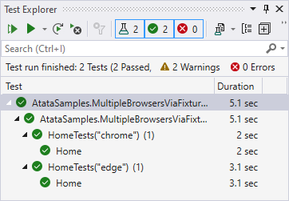

{{ page.description }}
{:.lead}




{{ download-section }}

This tutorial of multi-browser configuration is an alternative approach to [Multi-Browser Configuration via .runsettings files](https://atata.io/tutorials/multi-browser-configuration-via-runsettings-files/).
It is actually recommended to use `.runsettings` approach.
{:.warning}

Create a new Visual Studio tests project or use an existent one.
Use the [guide](/getting-started/#installation) to create a new Atata tests project.

NUnit is used as a test engine in this tutorial.
So ensure to reference  and  packages.
{:.info}

Drivers for Chrome and Internet Explorer in this tutorial are setup
using  package.
{:.info}

## SetUpFixture

Create the following class:

`SetUpFixture.cs`
{:.file-name}

```cs
using Atata;
using Atata.WebDriverSetup;
using NUnit.Framework;

namespace AtataSamples.MultipleBrowsersViaFixtureArguments
{
    [SetUpFixture]
    public class SetUpFixture
    {
        [OneTimeSetUp]
        public void GlobalSetUp()
        {
            AtataContext.GlobalConfiguration
                .UseChrome()
                    .WithArguments("start-maximized")
                .UseInternetExplorer()
                // TODO: Specify Internet Explorer settings, like:
                // WithOptions(x => x.EnableNativeEvents = true).
                //.UseFirefox().
                //    WithFixOfCommandExecutionDelay()
                // TODO: You can also specify remote driver configuration(s):
                // UseRemoteDriver().
                // WithAlias("chrome_remote").
                // WithRemoteAddress("http://127.0.0.1:4444/wd/hub").
                // WithOptions(new ChromeOptions()).
                .UseBaseUrl("https://demo.atata.io/")
                .UseCulture("en-US")
                .UseAllNUnitFeatures();

            DriverSetup.GetDefaultConfiguration(BrowserNames.InternetExplorer)
                .WithX32Architecture();

            AtataContext.GlobalConfiguration.AutoSetUpConfiguredDrivers();
        }
    }
}
```

In `SetUpFixture` you can configure all browser drivers you want to use.
`GlobalSetUp` method is invoked only once before all tests execution.

## UITestFixture

`UITestFixture` is often used as a base UI test fixture class.

`UITestFixture.cs`
{:.file-name}

```cs
using Atata;
using NUnit.Framework;

namespace AtataSamples.MultipleBrowsersViaFixtureArguments
{
    [TestFixture(DriverAliases.Chrome)]
    [TestFixture(DriverAliases.InternetExplorer)]
    //[TestFixture(DriverAliases.Firefox)]
    //[TestFixture("chrome_remote")]
    public abstract class UITestFixture
    {
        private readonly string driverAlias;

        protected UITestFixture(string driverAlias)
        {
            this.driverAlias = driverAlias;
        }

        [SetUp]
        public void SetUp()
        {
            AtataContext.Configure().
                UseDriver(driverAlias).
                UseTestName(() => $"[{driverAlias}]{TestContext.CurrentContext.Test.Name}").
                Build();
        }

        [TearDown]
        public void TearDown()
        {
            AtataContext.Current?.CleanUp();
        }
    }
}
```

Using `[TestFixture(...)]` attribute you can specify any number of drivers you want to use passing driver alias as a parameter.
Driver alias is passed to fixture via constructor argument and then is used in `SetUp` method to specify which driver to use for particular test (`UseDriver(driverAlias)`).

Instead of using `[TestFixture]` attribute you can also use `[TestFixtureSource]` attribute.

You can also specify custom test name considering driver alias, like above.

## Page Object

Create simple page object class:

`HomePage.cs`
{:.file-name}

```cs
using Atata;

namespace AtataSamples.MultipleBrowsersViaFixtureArguments
{
    using _ = HomePage;

    public class HomePage : Page<_>
    {
        public H1<_> Header { get; private set; }
    }
}
```

## Test Fixture

Now we can create specific test fixture with single test. Don't forget to define constructor and pass the argument to the base `UITestFixture` class.

`HomeTests.cs`
{:.file-name}

```cs
using Atata;
using NUnit.Framework;

namespace AtataSamples.MultipleBrowsersViaFixtureArguments
{
    public class HomeTests : UITestFixture
    {
        public HomeTests(string driverAlias)
            : base(driverAlias)
        {
        }

        [Test]
        public void Home()
        {
            Go.To<HomePage>().
                Header.Should.Equal("Atata Sample App");
        }
    }
}
```

## Run Tests

Build project and open Test Explorer panel in Visual Studio. For `Home` test you can find 3 items in the Test Explorer panel:




Run all tests and check the results.

*Please note that current tutorial requires Chrome and Internet Explorer browsers to be installed.*

{{ download-section }}