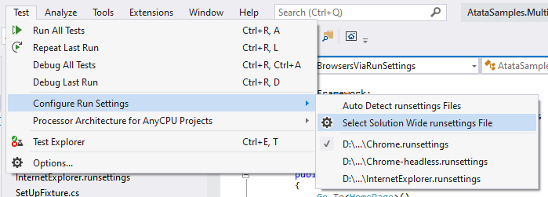

{{ page.description }}
{:.lead}




{{ download-section }}

Create a new Visual Studio tests project or use an existent one.
Use the [guide](/getting-started/#installation) to create a new Atata tests project.

NUnit is used as a test engine in this tutorial.
So ensure to reference  and  packages.
{:.info}

Drivers for Chrome and Internet Explorer in this tutorial are setup
using  package.
{:.info}

## Configuration of Atata.json

Different browser configurations can be defined in `Atata.json` file (or multiple files).
For example let's define everything in a single JSON file.

`Atata.json`
{:.file-name}

```json
{
  "drivers": [
    {
      "type": "chrome",
      "alias": "chrome",
      "options": {
        "arguments": [ "start-maximized" ]
      }
    },
    {
      "type": "chrome",
      "alias": "chrome-headless",
      "options": {
        "arguments": [ "headless", "window-size=1920,1080" ]
      }
    },
    {
      "type": "internetexplorer"
    }
  ],
  "baseUrl": "https://demo.atata.io/",
  "culture": "en-US",
  "useAllNUnitFeatures": true
}
```

In this example we configure 3 browser kinds: Chrome, Headless Chrome, Internet Explorer.
In case of we have 2 Chrome browsers, the `"alias"` property is added to both of them: `"chrome"` and `"chrome-headless"`.
For Internet Explorer `"alias"` is not required to be set, because it is single and by default it is `"internetexplorer"`.

## Configuration of .runsettings Files

For each browser configuration that we support, we need to create a separate `.runsettings` file.

Find out more information on `.runsettings` file and how to use it in Visual Studio on
[Configure unit tests by using a .runsettings file](https://docs.microsoft.com/en-us/visualstudio/test/configure-unit-tests-by-using-a-dot-runsettings-file?view=vs-2019) article.
{:.info}

`Chrome.runsettings`
{:.file-name}

```xml
<?xml version="1.0" encoding="utf-8"?>
<RunSettings>
  <TestRunParameters>
    <Parameter name="DriverAlias" value="chrome" />
  </TestRunParameters>
</RunSettings>
```

`Chrome-headless.runsettings`
{:.file-name}

```xml
<?xml version="1.0" encoding="utf-8"?>
<RunSettings>
  <TestRunParameters>
    <Parameter name="DriverAlias" value="chrome-headless" />
  </TestRunParameters>
</RunSettings>
```

`InternetExplorer.runsettings`
{:.file-name}

```xml
<?xml version="1.0" encoding="utf-8"?>
<RunSettings>
  <TestRunParameters>
    <Parameter name="DriverAlias" value="internetexplorer" />
  </TestRunParameters>
</RunSettings>
```

Each `.runsettings` file sets the `"DriverAlias"` test run parameter with a value
corresponding to the `"alias"` of driver configuration defined in Atata.json file.

## SetUpFixture

Now let's bind it all together in `SetUpFixture` class.

### NUnit

`SetUpFixture.cs`
{:.file-name}

```cs
using Atata;
using NUnit.Framework;

namespace AtataSamples.MultipleBrowsersViaRunSettings
{
    [SetUpFixture]
    public class SetUpFixture
    {
        [OneTimeSetUp]
        public void GlobalSetUp()
        {
            string driverAlias = TestContext.Parameters.Get("DriverAlias", DriverAliases.Chrome);

            AtataContext.GlobalConfiguration
                .ApplyJsonConfig()
                .UseDriver(driverAlias);

            DriverSetup.GetDefaultConfiguration(BrowserNames.InternetExplorer)
                .WithX32Architecture();

            AtataContext.GlobalConfiguration.AutoSetUpDriverToUse();
        }
    }
}
```

Here, through NUnit's `TestContext` class the `DriverAlias` parameter value is gotten.
Then this value is passed to `UseDriver` method of `AtataContext` in order to use configuration of driver defined with this alias.

Nothing is required to be added to specific fixtures or the base `UITestFixture`.
{:.info}

### MSTest

`SetUpFixture.cs`
{:.file-name}

```cs
using Atata;
using Microsoft.VisualStudio.TestTools.UnitTesting;

namespace AtataSamples.MultipleBrowsersViaRunSettings
{
    [TestClass]
    public static class SetUpFixture
    {
        [AssemblyInitialize]
        public static void AssemblyInit(TestContext context)
        {
            string driverAlias = (context.Properties["DriverAlias"] as string) ?? DriverAliases.Chrome;

            AtataContext.GlobalConfiguration
                .ApplyJsonConfig()
                .UseDriver(driverAlias);

            DriverSetup.GetDefaultConfiguration(BrowserNames.InternetExplorer)
                .WithX32Architecture();

            AtataContext.GlobalConfiguration.AutoSetUpDriverToUse();
        }
    }
}
```

## Usage in Visual Studio

To select/switch current `.runsettings` file in Visual Studio:



## Usage in CI/CD

In order to run tests on CI using concrete browser, use `-s` parameter of `dotnet test` command to specify `.runsettings` file.

```ps
dotnet test ./AtataSamples.MultipleBrowsersViaRunSettings.csproj -s Chrome-headless.runsettings
```

{{ download-section }}