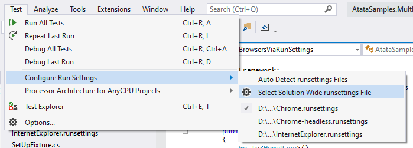

How to configure multi-browser tests application using *.runsettings* files.
{:.lead}




{{ download-section }}

## Prerequisites

Create a new Atata NUnit basic test project using the [guide](/getting-started/#installation).

Drivers for Chrome and Firefox in this tutorial are setup
using  package.
{:.info}

## Global fixture

A configuration of web drivers as well as other common configurations of Atata can be done in `GlobalFixture` class.
You can add many web driver configurations to `WebDriverSessionBuilder` and switch dynamically between them using `UseDriver` method.

In this example we configure 3 browser kinds: Chrome, headless Chrome, Firefox.
For headless Chrome we specify the `"chrome-headless"` alias to distinguish it from the headed Chrome, which has `"chrome"` alias by default.

`GlobalFixture.cs`
{:.file-name}

```cs
namespace AtataSamples.MultipleBrowsersViaRunSettings;

public sealed class GlobalFixture : AtataGlobalFixture
{
    protected override void ConfigureAtataContextBaseConfiguration(AtataContextBuilder builder)
    {
        string webDriverAlias = Environment.GetEnvironmentVariable("WebDriverAlias") ?? WebDriverAliases.Chrome;

        builder.Sessions.AddWebDriver(x => x
            .UseStartScopes(AtataContextScopes.Test)
            .ConfigureChrome(x => x
                .WithArguments(
                    "start-maximized",
                    "disable-search-engine-choice-screen")
                .WithArtifactsAsDownloadDirectory())
            .ConfigureChrome("chrome-headless", x => x
                .WithArguments(
                    "headless=new",
                    "window-size=1920,1080",
                    "disable-search-engine-choice-screen")
                .WithArtifactsAsDownloadDirectory())
            .ConfigureFirefox()
            .UseDriver(webDriverAlias)
            .UseBaseUrl("https://demo.atata.io/"));
    }

    protected override void ConfigureGlobalAtataContext(AtataContextBuilder builder) =>
        builder.SetUpWebDriversForUse();
}
```

Here, the `"WebDriverAlias"` environment variable is read.
Then this value is passed to `UseDriver` method of `WebDriverSessionBuilder` in order to use configuration of the driver defined with this alias.

## Configuration of *.runsettings* files

For each browser configuration that we support, we need to create a separate *.runsettings* file,
to be able to easily switch configurations in IDE as well as use in CI pipelines.

Find out more information on *.runsettings* file and how to use it in Visual Studio on
[Configure unit tests by using a *.runsettings* file](https://learn.microsoft.com/en-us/visualstudio/test/configure-unit-tests-by-using-a-dot-runsettings-file?view=visualstudio) article.
{:.info}

`Chrome.runsettings`
{:.file-name}

```xml
<?xml version="1.0" encoding="utf-8"?>
<RunSettings>
  <RunConfiguration>
    <EnvironmentVariables>
      <WebDriverAlias>chrome</WebDriverAlias>
    </EnvironmentVariables>
  </RunConfiguration>
</RunSettings>
```

`Chrome-headless.runsettings`
{:.file-name}

```xml
<?xml version="1.0" encoding="utf-8"?>
<RunSettings>
  <RunConfiguration>
    <EnvironmentVariables>
      <WebDriverAlias>chrome-headless</WebDriverAlias>
    </EnvironmentVariables>
  </RunConfiguration>
</RunSettings>
```

`Firefox.runsettings`
{:.file-name}

```xml
<?xml version="1.0" encoding="utf-8"?>
<RunSettings>
  <RunConfiguration>
    <EnvironmentVariables>
      <WebDriverAlias>firefox</WebDriverAlias>
    </EnvironmentVariables>
  </RunConfiguration>
</RunSettings>
```

Each *.runsettings* file sets the `"WebDriverAlias"` environment variable with a value
corresponding to the `"alias"` of driver configuration defined in `GlobalFixture` class.

## Usage in Visual Studio

To select/switch current *.runsettings* file in Visual Studio:



## Usage in CI/CD

In order to run tests on CI using concrete browser, use `-s` parameter of `dotnet test` command to specify a *.runsettings* file.

```ps
dotnet test ./AtataSamples.MultipleBrowsersViaRunSettings.csproj -s Chrome-headless.runsettings
```

{{ download-section }}