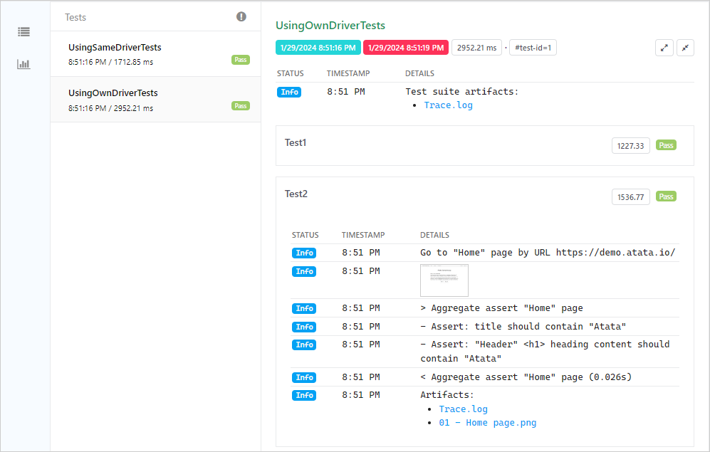

How to configure Atata reporting to [Extent Reports](https://extentreports.com/).
{:.lead}




{{ download-section }}

## Packages

In addition to  package,
the  package should be added to the project.

## Implementation

The functionality for Extent Reports is implemented in 3 class files:

- [**ExtentContext.cs**]({{ page.sources_path }}Infrastructure/ExtentContext.cs) -
  the main static class responsible for the initialization of Extent Reports.
  In this sample it attaches HTML reporter (`ExtentHtmlReporter`).
  Other Extent reporters can also be attached.
  Contains `WorkingFolder` property which targets the output folder path,
  which is by default `Path.Combine(AppDomain.CurrentDomain.BaseDirectory, "Report")`.
- [**ExtentLogConsumer.cs**]({{ page.sources_path }}Infrastructure/ExtentLogConsumer.cs) -
  is responsible for the reporting of log messages.
  Also does formatting of message.
- [**ExtentScreenshotConsumer.cs**]({{ page.sources_path }}Infrastructure/ExtentScreenshotConsumer.cs) -
  is responsible for the screenshot saving and adding them to report.

You can copy these files to your project and modify according to your project's needs.

## Configuration

In order to connect Extent Reports functionality to Atata add `ExtentLogConsumer` and `ExtentScreenshotConsumer` to `AtataContextBuilder`.

To perform generation of report file, the `Flush` should be performed as a final action of tests run.
In NUnit it's good to do it in `OneTimeTearDown` method of `SetUpFixture.cs`.

[`SetUpFixture.cs`]({{ page.sources_path }}SetUpFixture.cs)
{:.file-name}

```cs
using Atata;
using Atata.ExtentReports;
using NUnit.Framework;

namespace AtataSamples.ExtentReports
{
    [SetUpFixture]
    public class SetUpFixture
    {
        [OneTimeSetUp]
        public void GlobalSetUp()
        {
            AtataContext.GlobalConfiguration
                .UseChrome()
                    .WithArguments("window-size=1024,768")
                    .WithLocalDriverPath()
                .UseBaseUrl("https://atata.io/")
                .UseCulture("en-US")
                .UseAllNUnitFeatures()
                // Extent Reports specific configuration:
                .AddLogConsumer(new ExtentLogConsumer())
                .AddScreenshotConsumer(new ExtentScreenshotConsumer());
        }

        [OneTimeTearDown]
        public void GlobalTearDown()
        {
            ExtentContext.Reports.Flush();
        }
    }
}
```

## UITestFixture

`UITestFixture` is often used as a base UI test fixture class.
For this sample it is quite simple.

[`UITestFixture.cs`]({{ page.sources_path }}UITestFixture.cs)
{:.file-name}

```cs
using Atata;
using NUnit.Framework;
using NUnit.Framework.Internal;

namespace AtataSamples.ExtentReports
{
    [TestFixture]
    public class UITestFixture
    {
        [SetUp]
        public void SetUp()
        {
            AtataContext.Configure().Build();
        }

        [TearDown]
        public void TearDown()
        {
            AtataContext.Current?.CleanUp();
        }
    }
}
```

## Tests

2 sample tests were created in this sample.

[`ExtentReportsTests.cs`]({{ page.sources_path }}ExtentReportsTests.cs)
{:.file-name}

```cs
using Atata;
using NUnit.Framework;

namespace AtataSamples.ExtentReports
{
    public class ExtentReportsTests : UITestFixture
    {
        [Test]
        public void ExtentReports_Test1()
        {
            Go.To<HomePage>()
                .Report.Screenshot()
                .Header.Should.Contain("Atata");
        }

        [Test]
        public void ExtentReports_Test2()
        {
            Go.To<HomePage>()
                .Report.Screenshot()
                .AggregateAssert(x => x
                    .PageTitle.Should.Contain("Atata")
                    .Header.Should.Contain("Atata"));
        }
    }
}
```

In testing purposes the screenshot is taken after the navigation to the home page.
Also when the test fails at any moment, the screenshot is taken as well.

## Results

After the tests run, the generated Extent HTML report can be found by relative path:
`\AtataSamples.ExtentReports\bin\Debug\netcoreapp2.1\Report\index.html`.
All screenshot files are stored in the same folder as `index.html` file.



{{ download-section }}