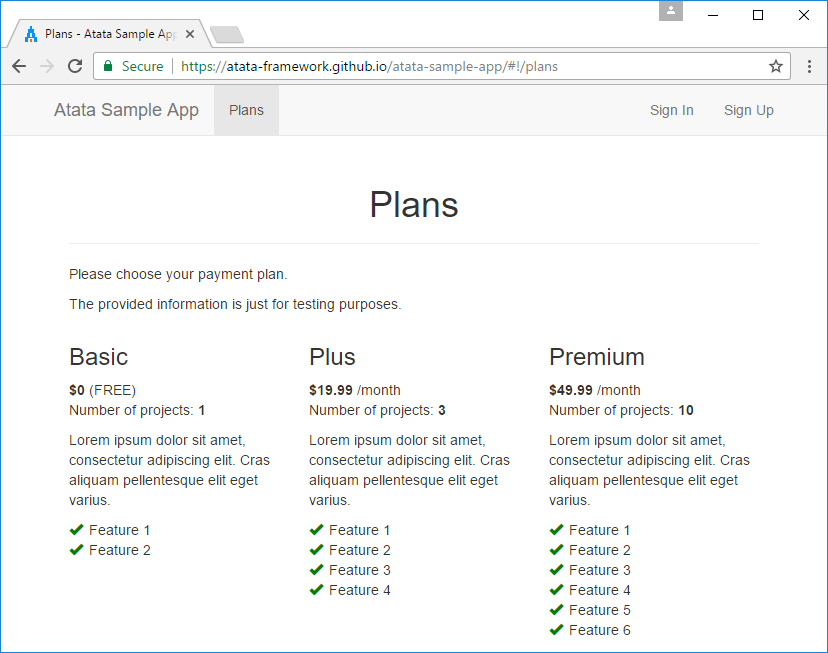
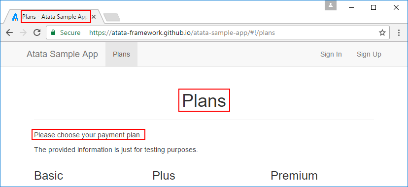
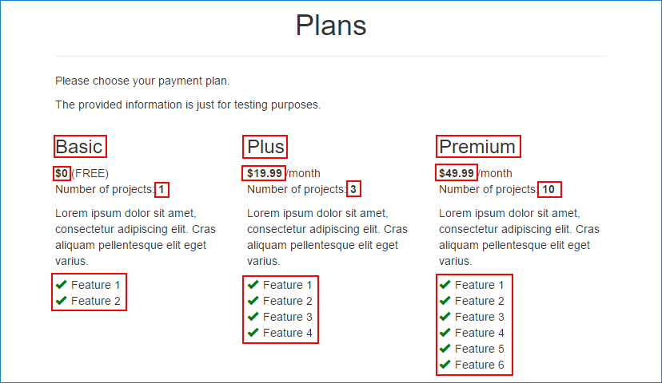

{{ page.description }}
{:.lead}




{{ download-section }}

## Introduction

In this tutorial, I would like to explain web page data verification approaches in details using Atata .NET test automation framework.
The article describes verification of: page title, headings, text content, numeric content, links and blocks of HTML content.

## Sample Page

For testing purposes of this tutorial, the following test page is used: [https://atata-framework.github.io/atata-sample-app/#!/plans](https://atata-framework.github.io/atata-sample-app/#!/plans). It is just a sample page for the demo containing different kinds of data.



## Set Up Test Project

Let's configure the testing environment.
In Visual Studio, create Class Library project and add the following NuGet packages:

* 
* 
* 
*  (or another driver package)

Define NUnit test class with `SetUp` and `TearDown` methods:

`PlanTests.cs`
{:.file-name}

```cs
using Atata;
using NUnit.Framework;

namespace AtataSamples.PageVerification
{
    [TestFixture]
    public class PlanTests
    {
        [SetUp]
        public void SetUp()
        {
            AtataContext.Configure().
                UseChrome().
                    WithArguments("start-maximized").
                UseBaseUrl("https://atata-framework.github.io/atata-sample-app/#!/").
                UseCulture("en-us").
                UseNUnitTestName().
                AddNUnitTestContextLogging().
                    WithoutSectionFinish().
                LogNUnitError().
                Build();
        }

        [TearDown]
        public void TearDown()
        {
            AtataContext.Current?.CleanUp();
        }
    }
}
```

And here is the basic page object class for the sample `Plans` page:

`PlansPage.cs`
{:.file-name}

```cs
using Atata;

namespace AtataSamples.PageVerification
{
    using _ = PlansPage;

    [Url("plans")]
    public class PlansPage : Page<_>
    {
    }
}
```

## Verification of Title, Heading and Text Content

Let's start with simple verifications.
To ensure that the current page is the one we need, we can verify its title, header and some text content.



### Verify in Test

For sure, we can do the verifications in test methods.
The one thing that is needed to be added to `PlansPage` is the `Header` property.

```cs
using Atata;

namespace AtataSamples.PageVerification
{
    using _ = PlansPage;

    [Url("plans")]
    public class PlansPage : Page<_>
    {
        public H1<_> Header { get; private set; }
    }
}
```

Now we can implement test method in `PlanTests` fixture.

```cs
[Test]
public void PrimaryPageDataVerification_InTest()
{
    Go.To<PlansPage>().
        PageTitle.Should.Equal("Plans - Atata Sample App").
        Header.Should.Equal("Plans").
        Content.Should.Contain("Please choose your payment plan");
}
```

### Verify in OnVerify Method

`PageObject` class has virtual `OnVerify` method that can be overridden for inner page object verifications.

`PlansWithOnVerifyPage.cs`
{:.file-name}

```cs
using Atata;

namespace AtataSamples.PageVerification
{
    using _ = PlansWithOnVerifyPage;

    [Url("plans")]
    public class PlansWithOnVerifyPage : Page<_>
    {
        public H1<_> Header { get; private set; }

        protected override void OnVerify()
        {
            base.OnVerify();

            PageTitle.Should.Equal("Plans - Atata Sample App");
            Header.Should.Equal("Plans");
            Content.Should.Contain("Please choose your payment plan");
        }
    }
}
```

And the test will look this way:

```cs
[Test]
public void PrimaryPageDataVerification_OnVerify()
{
    Go.To<PlansWithOnVerifyPage>();
}
```

`OnVerify` method will be invoked during the navigation to the page object.

### Verify Using Static Triggers

Another approach is quite simple.
You can use a set of [verification trigger attributes](/triggers/#verification) to mark with them a page object class or control properties.

`PlansWithStaticTriggersPage.cs`
{:.file-name}

```cs
using Atata;

namespace AtataSamples.PageVerification
{
    using _ = PlansWithStaticTriggersPage;

    [Url("plans")]
    [VerifyTitle("Plans - Atata Sample App")]
    [VerifyH1("Plans")]
    [VerifyContent("Please choose your payment plan")]
    public class PlansWithStaticTriggersPage : Page<_>
    {
    }
}
```

And the test:

```cs
[Test]
public void PrimaryPageDataVerification_StaticTriggers()
{
    Go.To<PlansWithStaticTriggersPage>();
}
```

Atata will execute the specified triggers during the navigation to the page object.

### Verify Using Dynamic Triggers

And finally, you can add verification triggers dynamically.
It is helpful when you need to pass the parameters for the triggers using constructor of page object, or if you need to get them from an external source.

`PlansWithDynamicTriggersPage.cs`
{:.file-name}

```cs
using Atata;

namespace AtataSamples.PageVerification
{
    using _ = PlansWithDynamicTriggersPage;

    [Url("plans")]
    public class PlansWithDynamicTriggersPage : Page<_>
    {
        public PlansWithDynamicTriggersPage()
        {
            Triggers.Add(
                new VerifyTitleAttribute("Plans - Atata Sample App"),
                new VerifyH1Attribute("Plans"),
                new VerifyContentAttribute("Please choose your payment plan"));
        }
    }
}
```

It is possible to add triggers dynamically for the component in constructor or in overridden `OnInit` method.

```cs
[Test]
public void PrimaryPageDataVerification_DynamicTriggers()
{
    Go.To<PlansWithDynamicTriggersPage>();
}
```

## Verification of Complex Blocks

Let's try to verify the plan items.
It's a bit complex, but quite simple.
We can check: name, price, number of projects and features.



Fine, we have a list of 3 plan items.
Let's check the HTML source and try to determine element paths for the needed components.

```html
<div class="row">
    <div class="col-sm-4 plan-item">
        <h3>Basic</h3>
        <b class="price">$0</b> (FREE)
        <p>Number of projects: <b class="projects-num">1</b></p>
        <p>Lorem ipsum dolor sit amet, consectetur adipiscing elit. 
           Cras aliquam pellentesque elit eget varius.</p>
        <ul class="feature-list">
            <li><span class="glyphicon glyphicon-ok"></span>Feature 1</li>
            <li><span class="glyphicon glyphicon-ok"></span>Feature 2</li>
        </ul>
    </div>
    <div class="col-sm-4 plan-item">
        <h3>Plus</h3>
        <b class="price">$19.99</b> /month
        ...
    </div>
    <div class="col-sm-4 plan-item">
        <h3>Premium</h3>
        ...
    </div>
</div>
```

Let's summarize.
First of all, we can extract plan item as a control that is `<div>` element with `plan-item` class. And the control has the following properties:

* **Name** - the first and single `<h3>` element.
* **Price** - currency element with `price` class.
* **Number of projects** - numeric element with `projects-num` class.
* **Features** - a set `<li>` elements inside `<ul>`.

In Atata we need to define a custom control for such a plan item.
And then, in the page object, we can use property of `ControlList` type to manipulate the items.

```cs
using Atata;

namespace AtataSamples.PageVerification
{
    using _ = PlansPage;

    [Url("plans")]
    public class PlansPage : Page<_>
    {
        public H1<_> Header { get; private set; }

        public ControlList<PlanItem, _> PlanItems { get; private set; }

        [ControlDefinition("div", ContainingClass = "plan-item", ComponentTypeName = "plan item")]
        public class PlanItem : Control<_>
        {
            public H3<_> Title { get; private set; }

            [FindByClass]
            public Currency<_> Price { get; private set; }

            [FindByClass("projects-num")]
            public Number<_> NumberOfProjects { get; private set; }

            public UnorderedList<Text<_>, _> Features { get; private set; }
        }
    }
}
```

And now, we can implement a test that should verify the data of the plan items.

```cs
private const string Feature1 = "Feature 1";
private const string Feature2 = "Feature 2";
private const string Feature3 = "Feature 3";
private const string Feature4 = "Feature 4";
private const string Feature5 = "Feature 5";
private const string Feature6 = "Feature 6";

[Test]
public void ComplexPageDataVerification()
{
    Go.To<PlansPage>().
        PlanItems.Count.Should.Equal(3).

        PlanItems[0].Title.Should.Equal("Basic").
        PlanItems[0].Price.Should.Equal(0).
        PlanItems[0].NumberOfProjects.Should.Equal(1).
        PlanItems[0].Features.Items.Should.EqualSequence(Feature1, Feature2).

        PlanItems[1].Title.Should.Equal("Plus").
        PlanItems[1].Price.Should.Equal(19.99m).
        PlanItems[1].NumberOfProjects.Should.Equal(3).
        PlanItems[1].Features.Items.Should.EqualSequence(Feature1, Feature2, Feature3, Feature4).

        PlanItems[2].Title.Should.Equal("Premium").
        PlanItems[2].Price.Should.Equal(49.99m).
        PlanItems[2].NumberOfProjects.Should.Equal(10).
        PlanItems[2].Features.Items.Should.EqualSequence(Feature1, Feature2, Feature3, Feature4, Feature5, Feature6);
}
```

This is it.
If you run this test, it will succeed and generate the following log to NUnit console:

```
2018-06-03 13:06:48.0213 INFO Starting test: ComplexPageDataVerification
2018-06-03 13:06:48.0433 TRACE Set up AtataContext
2018-06-03 13:06:48.0433 TRACE Set: BaseUrl=https://atata-framework.github.io/atata-sample-app/#!/
2018-06-03 13:06:48.0443 TRACE Set: ElementFindTimeout=5.000s; ElementFindRetryInterval=0.500s
2018-06-03 13:06:48.0443 TRACE Set: WaitingTimeout=5.000s; WaitingRetryInterval=0.500s
2018-06-03 13:06:48.0443 TRACE Set: VerificationTimeout=5.000s; VerificationRetryInterval=0.500s
2018-06-03 13:06:48.0443 TRACE Set: Culture=en-US
2018-06-03 13:06:50.8337 TRACE Set: Driver=ChromeDriver (alias=chrome)
2018-06-03 13:06:50.8822 INFO Go to "Plans" page
2018-06-03 13:06:50.9152 INFO Go to URL "https://atata-framework.github.io/atata-sample-app/#!/plans"
2018-06-03 13:06:51.6357 INFO Verify plan items count should equal "3"
2018-06-03 13:06:51.7569 INFO Verify "1st" plan item's "Title" <h3> heading content should equal "Basic"
2018-06-03 13:06:51.8406 INFO Verify "1st" plan item's "Price" element content should equal "$0.00"
2018-06-03 13:06:51.9117 INFO Verify "1st" plan item's "Number of Projects" element content should equal "1"
2018-06-03 13:06:51.9814 INFO Verify "1st" plan item's "Features" unordered list items should equal sequence <"Feature 1", "Feature 2">
2018-06-03 13:06:52.1050 INFO Verify "2nd" plan item's "Title" <h3> heading content should equal "Plus"
2018-06-03 13:06:52.1755 INFO Verify "2nd" plan item's "Price" element content should equal "$19.99"
2018-06-03 13:06:52.2391 INFO Verify "2nd" plan item's "Number of Projects" element content should equal "3"
2018-06-03 13:06:52.3019 INFO Verify "2nd" plan item's "Features" unordered list items should equal sequence <"Feature 1", "Feature 2", "Feature 3", "Feature 4">
2018-06-03 13:06:52.4739 INFO Verify "3rd" plan item's "Title" <h3> heading content should equal "Premium"
2018-06-03 13:06:52.5442 INFO Verify "3rd" plan item's "Price" element content should equal "$49.99"
2018-06-03 13:06:52.6050 INFO Verify "3rd" plan item's "Number of Projects" element content should equal "10"
2018-06-03 13:06:52.6665 INFO Verify "3rd" plan item's "Features" unordered list items should equal sequence <"Feature 1", "Feature 2", "Feature 3", "Feature 4", "Feature 5", "Feature 6">
2018-06-03 13:06:52.9410 INFO Clean up test context
2018-06-03 13:06:53.0138 INFO Finished test (5.227s)
2018-06-03 13:06:53.0143 INFO Pure test execution time: 2.105s
```

{{ download-section }}