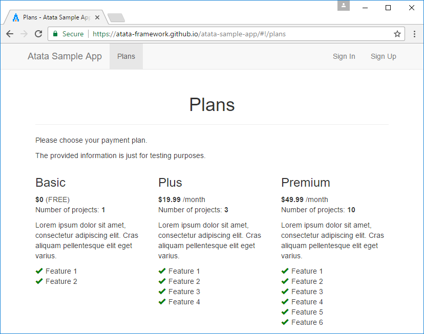
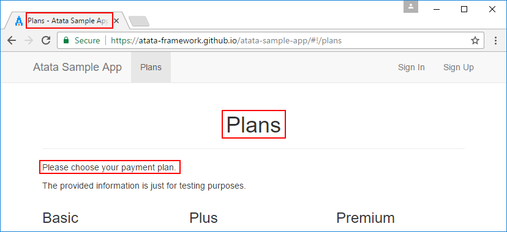
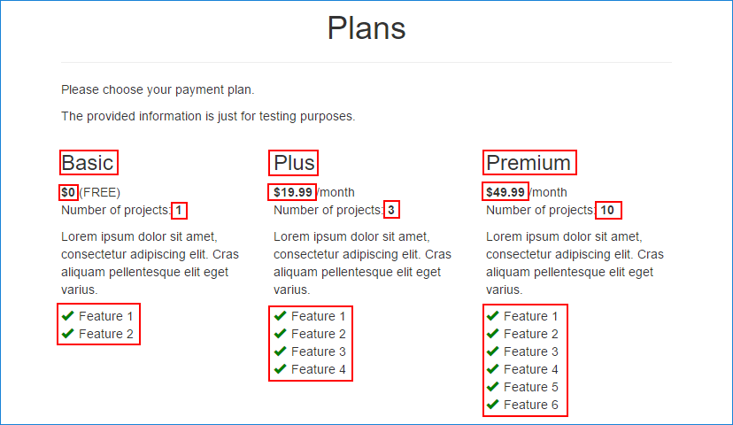

{{ page.description }}
{:.lead}




{{ download-section }}

## Introduction

The purpose of this tutorial is to demonstrate in detail different approaches of web page data verification using Atata Framework.
The article describes verification of: page title, headings, text content, numeric content, links and blocks of HTML content.

## Page under test

For testing purposes of this tutorial, the following test page is used: <https://demo.atata.io/plans>.
It is just a sample page for the demo containing different kinds of data.



## Set up test project

### Create project

First of all, let's create a project for tests (e.g., named "AtataSamples.PageVerification").
In Visual Studio create a project for Atata automated testing using the [guide](/getting-started/#installation).

### Create test suite class

Create a test suite class:

`PlanTests.cs`
{:.file-name}

```cs
namespace AtataSamples.PageVerification;

public sealed class PlanTests : AtataTestSuite
{
}
```

### Create page object class

Create a page object class for the "Plans" page:

`PlansPage.cs`
{:.file-name}

```cs
namespace AtataSamples.PageVerification;

using _ = PlansPage;

[Url("plans")]
public sealed class PlansPage : Page<_>
{
}
```

## Verification of title, heading and text content

Let's start with simple verifications.
To ensure that the current page is the one we need, we can verify its title, header and some text content.



### Verify in Test

For sure, we can do the verifications in test methods.
The one thing that is needed to be added to `PlansPage` is the `Header` property.

```cs
namespace AtataSamples.PageVerification;

using _ = PlansPage;

[Url("plans")]
public sealed class PlansPage : Page<_>
{
    public H1<_> Header { get; private set; }
}
```

Now we can implement a test method in `PlanTests` fixture.

```cs
[Test]
public void PrimaryPageDataVerification_InTest() =>
    Go.To<PlansPage>()
        .PageTitle.Should.Be("Plans - Atata Sample App")
        .Header.Should.Be("Plans")
        .Content.Should.Contain("Please choose your payment plan");
```

### Verify in `OnVerify` method

`PageObject<TOwner>` class has a virtual `OnVerify` method that can be overridden for inner page object verifications.

`PlansWithOnVerifyPage.cs`
{:.file-name}

```cs
namespace AtataSamples.PageVerification;

using _ = PlansWithOnVerifyPage;

[Url("plans")]
public sealed class PlansWithOnVerifyPage : Page<_>
{
    public H1<_> Header { get; private set; }

    protected override void OnVerify()
    {
        base.OnVerify();

        PageTitle.Should.Be("Plans - Atata Sample App");
        Header.Should.Be("Plans");
        Content.Should.Contain("Please choose your payment plan");
    }
}
```

And the test will look this way:

```cs
[Test]
public void PrimaryPageDataVerification_OnVerify() =>
    Go.To<PlansWithOnVerifyPage>();
```

`OnVerify` method will be invoked during the navigation to the page object.

### Verify using static triggers

Another approach is quite simple.
You can use a set of [verification trigger attributes](/triggers/#verification)
to mark a page object class or control properties with them.

`PlansWithStaticTriggersPage.cs`
{:.file-name}

```cs
namespace AtataSamples.PageVerification;

using _ = PlansWithStaticTriggersPage;

[Url("plans")]
[VerifyTitle("Plans - Atata Sample App")]
[VerifyH1("Plans")]
[VerifyContent("Please choose your payment plan")]
public sealed class PlansWithStaticTriggersPage : Page<_>
{
}
```

And the test:

```cs
[Test]
public void PrimaryPageDataVerification_StaticTriggers() =>
    Go.To<PlansWithStaticTriggersPage>();
```

Atata will execute the specified triggers during the navigation to the page object.

### Verify using dynamic triggers

And finally, you can add verification triggers dynamically.
It is helpful when you need to pass the parameters for the triggers using constructor of page object, or if you need to get them from an external source.

`PlansWithDynamicTriggersPage.cs`
{:.file-name}

```cs
namespace AtataSamples.PageVerification;

using _ = PlansWithDynamicTriggersPage;

[Url("plans")]
public sealed class PlansWithDynamicTriggersPage : Page<_>
{
    public PlansWithDynamicTriggersPage() =>
        Metadata.Add(
            new VerifyTitleAttribute("Plans - Atata Sample App"),
            new VerifyH1Attribute("Plans"),
            new VerifyContentAttribute("Please choose your payment plan"));
}
```

It is possible to add triggers dynamically for the component in constructor or in overridden `OnInit` method.

```cs
[Test]
public void PrimaryPageDataVerification_DynamicTriggers() =>
    Go.To<PlansWithDynamicTriggersPage>();
```

## Verification of complex blocks

Let's try to verify the plan items.
It's a bit complex, but quite simple.
For each plan we can assert: name, price, number of projects and features.



Fine, we have a list of 3 plan items.
Let's check the HTML source and try to determine element paths for the needed components.

```html
<div class="row">
    <div class="col-sm-4 plan-item">
        <h3>Basic</h3>
        <b class="price">$0</b> (FREE)
        <p>Number of projects: <b class="projects-num">1</b></p>
        <p>Lorem ipsum dolor sit amet, consectetur adipiscing elit. 
           Cras aliquam pellentesque elit eget varius.</p>
        <ul class="feature-list">
            <li><span class="glyphicon glyphicon-ok"></span>Feature 1</li>
            <li><span class="glyphicon glyphicon-ok"></span>Feature 2</li>
        </ul>
    </div>
    <div class="col-sm-4 plan-item">
        <h3>Plus</h3>
        <b class="price">$19.99</b> /month
        ...
    </div>
    <div class="col-sm-4 plan-item">
        <h3>Premium</h3>
        ...
    </div>
</div>
```

Let's summarize.
First of all, we can extract plan item as a control that is `<div>` element with `plan-item` class. And the control has the following properties:

* **Name** - the first and single `<h3>` element.
* **Price** - currency element with `price` class.
* **Number of projects** - numeric element with `projects-num` class.
* **Features** - a list of `<li>` elements inside `<ul>`.

In Atata we need to define a custom control for such a plan item.
And then, in the page object, we can use property of `ControlList` type to manipulate the items.

```cs
namespace AtataSamples.PageVerification;

using _ = PlansPage;

[Url("plans")]
public sealed class PlansPage : Page<_>
{
    public H1<_> Header { get; private set; }

    public ControlList<PlanItem, _> PlanItems { get; private set; }

    [ControlDefinition("div", ContainingClass = "plan-item", ComponentTypeName = "plan item")]
    public sealed class PlanItem : Control<_>
    {
        public H3<_> Title { get; private set; }

        [FindByClass]
        public Currency<_> Price { get; private set; }

        [FindByClass("projects-num")]
        public Number<_> NumberOfProjects { get; private set; }

        public UnorderedList<Text<_>, _> Features { get; private set; }
    }
}
```

And now, we can implement a test that should verify the data of the plan items.

```cs
private const string Feature1 = "Feature 1";
private const string Feature2 = "Feature 2";
private const string Feature3 = "Feature 3";
private const string Feature4 = "Feature 4";
private const string Feature5 = "Feature 5";
private const string Feature6 = "Feature 6";

[Test]
public void ComplexPageDataVerification() =>
    Go.To<PlansPage>()
        .AggregateAssert(x => x
            .PlanItems.Count.Should.Be(3)
            .PlanItems[0].Title.Should.Be("Basic")
            .PlanItems[0].Price.Should.Be(0)
            .PlanItems[0].NumberOfProjects.Should.Be(1)
            .PlanItems[0].Features.Items.Should.EqualSequence(Feature1, Feature2)

            .PlanItems[1].Title.Should.Be("Plus")
            .PlanItems[1].Price.Should.Be(19.99m)
            .PlanItems[1].NumberOfProjects.Should.Be(3)
            .PlanItems[1].Features.Items.Should.EqualSequence(Feature1, Feature2, Feature3, Feature4)

            .PlanItems[2].Title.Should.Be("Premium")
            .PlanItems[2].Price.Should.Be(49.99m)
            .PlanItems[2].NumberOfProjects.Should.Be(10)
            .PlanItems[2].Features.Items.Should.EqualSequence(Feature1, Feature2, Feature3, Feature4, Feature5, Feature6));
```

This is it.
If you run this test, it will succeed and generate the following log to NUnit console (when minimum log level is Debug):

```
00:00:00.000 360D DEBUG Starting test AtataSamples.PageVerification.PlanTests.ComplexPageDataVerification at 2026-03-30 11:15:26.767
00:00:00.690 FLD0  INFO > Go to "Plans" page by URL https://demo.atata.io/plans
00:00:00.852 FLD0  INFO < Go to "Plans" page by URL https://demo.atata.io/plans (0.162s)
00:00:00.856 FLD0  INFO > Aggregate assert "Plans" page
00:00:00.865 FLD0  INFO - > Assert: plan items count should be 3
00:00:01.099 FLD0  INFO - < Assert: plan items count should be 3 (0.233s)
00:00:01.104 FLD0  INFO - > Assert: plan items / 1st item / "Title" <h3> heading content should be "Basic"
00:00:01.157 FLD0  INFO - < Assert: plan items / 1st item / "Title" <h3> heading content should be "Basic" (0.052s)
00:00:01.161 FLD0  INFO - > Assert: plan items / 1st item / "Price" element content should be "$0.00"
00:00:01.201 FLD0  INFO - < Assert: plan items / 1st item / "Price" element content should be "$0.00" (0.039s)
00:00:01.202 FLD0  INFO - > Assert: plan items / 1st item / "Number of Projects" element content should be "1"
00:00:01.271 FLD0  INFO - < Assert: plan items / 1st item / "Number of Projects" element content should be "1" (0.068s)
00:00:01.273 FLD0  INFO - > Assert: plan items / 1st item / "Features" unordered list / items should equal sequence ["Feature 1", "Feature 2"]
00:00:01.375 FLD0  INFO - < Assert: plan items / 1st item / "Features" unordered list / items should equal sequence ["Feature 1", "Feature 2"] (0.101s)
00:00:01.376 FLD0  INFO - > Assert: plan items / 2nd item / "Title" <h3> heading content should be "Plus"
00:00:01.401 FLD0  INFO - < Assert: plan items / 2nd item / "Title" <h3> heading content should be "Plus" (0.024s)
00:00:01.401 FLD0  INFO - > Assert: plan items / 2nd item / "Price" element content should be "$19.99"
00:00:01.419 FLD0  INFO - < Assert: plan items / 2nd item / "Price" element content should be "$19.99" (0.017s)
00:00:01.420 FLD0  INFO - > Assert: plan items / 2nd item / "Number of Projects" element content should be "3"
00:00:01.437 FLD0  INFO - < Assert: plan items / 2nd item / "Number of Projects" element content should be "3" (0.017s)
00:00:01.438 FLD0  INFO - > Assert: plan items / 2nd item / "Features" unordered list / items should equal sequence ["Feature 1", "Feature 2", "Feature 3", "Feature 4"]
00:00:01.561 FLD0  INFO - < Assert: plan items / 2nd item / "Features" unordered list / items should equal sequence ["Feature 1", "Feature 2", "Feature 3", "Feature 4"] (0.122s)
00:00:01.562 FLD0  INFO - > Assert: plan items / 3rd item / "Title" <h3> heading content should be "Premium"
00:00:01.583 FLD0  INFO - < Assert: plan items / 3rd item / "Title" <h3> heading content should be "Premium" (0.021s)
00:00:01.584 FLD0  INFO - > Assert: plan items / 3rd item / "Price" element content should be "$49.99"
00:00:01.600 FLD0  INFO - < Assert: plan items / 3rd item / "Price" element content should be "$49.99" (0.016s)
00:00:01.601 FLD0  INFO - > Assert: plan items / 3rd item / "Number of Projects" element content should be "10"
00:00:01.616 FLD0  INFO - < Assert: plan items / 3rd item / "Number of Projects" element content should be "10" (0.015s)
00:00:01.616 FLD0  INFO - > Assert: plan items / 3rd item / "Features" unordered list / items should equal sequence [
  "Feature 1",
  "Feature 2",
  "Feature 3",
  "Feature 4",
  "Feature 5",
  "Feature 6"
]
00:00:01.765 FLD0  INFO - < Assert: plan items / 3rd item / "Features" unordered list / items should equal sequence [
  "Feature 1",
  "Feature 2",
  "Feature 3",
  "Feature 4",
  "Feature 5",
  "Feature 6"
] (0.149s)
00:00:01.766 FLD0  INFO < Aggregate assert "Plans" page (0.909s)
00:00:01.917 360D DEBUG Finished test with passed status at 2026-03-30 11:15:28.685
      Total time: 1.914s
  Initialization: 0.654s | 34.2 %
       Test body: 1.114s | 58.2 %
Deinitialization: 0.145s |  7.6 %
```

{{ download-section }}