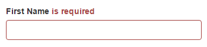
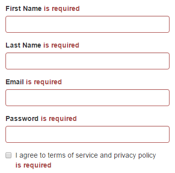
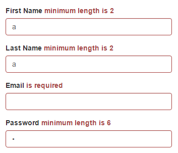
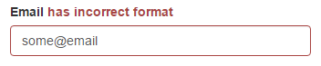

{{ page.description }}
{:.lead}




{{ download-section }}

## Introduction

In this tutorial, I would like to demonstrate Atata Framework abilities of validation messages verification.
There are tons of different approaches to display validation/error messages.
It is impossible to cover all cases, so I will try to cover one sample, but I hope you will get the idea to apply it to specific websites.

## Page Under Test

For testing purposes of this tutorial, the following test page is used: <https://demo.atata.io/signup>.


The page has the following validators: required, min length, max length and email.

## Set Up Test Project

### Create Project

First of all, let's create a project for tests (e.g., named "AtataSamples.ValidationMessagesVerification").
In Visual Studio create a project for Atata automated testing using the [guide](/getting-started/#installation).

### Create Test Fixture Class

Create "Atata NUnit Test Fixture" class:

`SignUpTests.cs`
{:.file-name}

```cs
using Atata;
using NUnit.Framework;

namespace AtataSamples.ValidationMessagesVerification
{
    public class SignUpTests : UITestFixture
    {
    }
}
```

### Create Page Object Class

Create a page object for Sign Up page:

`SignUpPage.cs`
{:.file-name}

```cs
using Atata;

namespace AtataSamples.ValidationMessagesVerification
{
    using _ = SignUpPage;

    [Url("signup")]
    public class SignUpPage : Page<_>
    {
        public TextInput<_> FirstName { get; private set; }

        public TextInput<_> LastName { get; private set; }

        public TextInput<_> Email { get; private set; }

        public PasswordInput<_> Password { get; private set; }

        [FindByLabel("I agree to terms of service and privacy policy")]
        public CheckBox<_> Agreement { get; private set; }

        public Button<_> SignUp { get; private set; }
    }
}
```

## Validation Message Components

Now we need to implement a functionality for validation messages.
First of all, we need to detect HTML element responsible for validation message and the path to it.



Using any browser developer tools you can find the following HTML markup:

```html
<div class="form-group has-error">
    <label for="first-name">First Name</label>
    <span class="help-block">
        is required
    </span>
    <input type="text" id="first-name" class="form-control touched dirty invalid">
</div>
```

Shortly, validation message - is `<span>` element with `help-block` class that is located inside `<div>` with `has-error` class.
We need to build XPath:

`div[contains(concat(' ', normalize-space(@class), ' '), ' has-error ')]//span[contains(concat(' ', normalize-space(@class), ' '), ' help-block ')]`

Let's define component class responsible for validation message.
Validation message is a text inside the `<span>` element, so inherit it form `Text<TOwner>` Atata control and specify the XPath.

``ValidationMessage`1.cs``
{:.file-name}

```cs
using Atata;

namespace AtataSamples.ValidationMessagesVerification
{
    [ControlDefinition("div[contains(concat(' ', normalize-space(@class), ' '), ' has-error ')]//span[contains(concat(' ', normalize-space(@class), ' '), ' help-block ')]")]
    public class ValidationMessage<TOwner> : Text<TOwner>
        where TOwner : PageObject<TOwner>
    {
    }
}
```

And now we need to define a class representing the collection of validation message components:

``ValidationMessageList`1.cs``
{:.file-name}

```cs
using Atata;
using OpenQA.Selenium;

namespace AtataSamples.ValidationMessagesVerification
{
    public class ValidationMessageList<TOwner> : AssociatedControlList<ValidationMessage<TOwner>, TOwner>
        where TOwner : PageObject<TOwner>
    {
        protected override ValidationMessage<TOwner> CreateAssociatedControl(Control<TOwner> control)
        {
            var validationMessageDefinition = UIComponentResolver.GetControlDefinition(typeof(ValidationMessage<TOwner>));

            PlainScopeLocator scopeLocator = new PlainScopeLocator(By.XPath("ancestor::" + validationMessageDefinition.ScopeXPath))
            {
                SearchContext = control.Scope
            };

            return Component.Controls.Create<ValidationMessage<TOwner>>(control.ComponentName, scopeLocator);
        }
    }
}
```

What does it do?
First of all, it inherits `AssociatedControlList` - special control list class that provides a basic functionality to get associated/dependent control to another control.
So our class represents the list of associated controls of `ValidationMessage<TOwner>` type.

In `CreateAssociatedControl` method it creates scope locator for validation message.
Scope locator will first search the bound control, for example `<input>` of First Name,
and then will look in HTML document for validation message control, relatively to bound control,
that matches the XPath that we defined for `ValidationMessage<TOwner>`.

Examples of using `ValidationMessageList<TOwner>` that find a message for First Name:

```cs
pageObject.ValidationMessages.For(x => x.FirstName).Should...
pageObject.ValidationMessages[x => x.FirstName].Should...
```

And if you need to assert that there are no validation messages:

```cs
pageObject.ValidationMessages.Should.BeEmpty()
```

So for validation messages, in this case, we don't need to define separate properties in page objects, but just use common validation message list and locate messages relatively to the input controls.

And the final thing is to add a property of `ValidationMessageList<TOwner>` type to `SignUpPage` page object:

`SignUpPage.cs`
{:.file-name}

```cs
using Atata;

namespace AtataSamples.ValidationMessagesVerification
{
    using _ = SignUpPage;

    [Url("signup")]
    public class SignUpPage : Page<_>
    {
        // Input properties...

        public ValidationMessageList<_> ValidationMessages { get; private set; }
    }
}

```

For any other page objects that use the same validation approach we just also need to add `ValidationMessages` property.

## Tests

Now we can use all this stuff together. Let's create 3 tests for validation messages verification in `SignUpTests` class.

### Verify Messages of Required Fields



```cs
[Test]
public void Validation_Required()
{
    Go.To<SignUpPage>()
        .SignUp.Click()
        .AggregateAssert(page => page
            .ValidationMessages[x => x.FirstName].Should.Equal("is required")
            .ValidationMessages[x => x.LastName].Should.Equal("is required")
            .ValidationMessages[x => x.Email].Should.Equal("is required")
            .ValidationMessages[x => x.Password].Should.Equal("is required")
            .ValidationMessages[x => x.Agreement].Should.Equal("is required")
            .ValidationMessages.Should.HaveCount(5));
}
```

### Verify Messages of Minimum Length



```cs
[Test]
public void Validation_MinLength()
{
    Go.To<SignUpPage>()
        .FirstName.Set("a")
        .LastName.Set("a")
        .Password.Set("a")
        .SignUp.Click()
        .AggregateAssert(page => page
            .ValidationMessages[x => x.FirstName].Should.Equal("minimum length is 2")
            .ValidationMessages[x => x.LastName].Should.Equal("minimum length is 2")
            .ValidationMessages[x => x.Password].Should.Equal("minimum length is 6"));
}
```

### Verify Message of Incorrect Email



```cs
[Test]
public void Validation_IncorrectEmail()
{
    Go.To<SignUpPage>()
        .Email.Set("some@email")
        .SignUp.Click()
        .ValidationMessages[x => x.Email].Should.Equal("has incorrect format")
        .Email.Type(".com")
        .SignUp.Click()
        .ValidationMessages[x => x.Email].Should.Not.Exist();
}
```

## Verification Message Extension Methods

Tests look OK but there is a nicer way to verify validation messages.
We can extract verifications to extension methods.
First of all, let's modify `ValidationMessage<TOwner>` class by adding `Should` property of specific type:

``ValidationMessage`1.cs``
{:.file-name}

```cs
using Atata;

namespace AtataSamples.ValidationMessagesVerification
{
    [ControlDefinition("div[contains(concat(' ', normalize-space(@class), ' '), ' has-error ')]//span[contains(concat(' ', normalize-space(@class), ' '), ' help-block ')]")]
    public class ValidationMessage<TOwner> : Text<TOwner>
        where TOwner : PageObject<TOwner>
    {
        public new FieldVerificationProvider<string, ValidationMessage<TOwner>, TOwner> Should =>
            new FieldVerificationProvider<string, ValidationMessage<TOwner>, TOwner>(this);
    }
}
```

Then we can start the creation of verification extension methods:

`ValidationMessageExtensions.cs`
{:.file-name}

```cs
using Atata;

namespace AtataSamples.ValidationMessagesVerification
{
    public static class ValidationMessageExtensions
    {
        public static TOwner BeRequired<TOwner>(this IFieldVerificationProvider<string, ValidationMessage<TOwner>, TOwner> should)
            where TOwner : PageObject<TOwner>
        {
            return should.Equal("is required");
        }

        public static TOwner HaveIncorrectFormat<TOwner>(this IFieldVerificationProvider<string, ValidationMessage<TOwner>, TOwner> should)
            where TOwner : PageObject<TOwner>
        {
            return should.Equal("has incorrect format");
        }

        public static TOwner HaveMinLength<TOwner>(this IFieldVerificationProvider<string, ValidationMessage<TOwner>, TOwner> should, int length)
            where TOwner : PageObject<TOwner>
        {
            return should.Equal($"minimum length is {length}");
        }

        public static TOwner HaveMaxLength<TOwner>(this IFieldVerificationProvider<string, ValidationMessage<TOwner>, TOwner> should, int length)
            where TOwner : PageObject<TOwner>
        {
            return should.Equal($"maximum length is {length}");
        }
    }
}
```

Now we keep validation message strings in one place and will just operate validation verification extension methods.

## Tests Using Extension Methods

Now we can update our tests with the use of extension methods.

```cs
[Test]
public void Validation_Required_UsingExtensions()
{
    Go.To<SignUpPage>()
        .SignUp.Click()
        .AggregateAssert(page => page
            .ValidationMessages[x => x.FirstName].Should.BeRequired()
            .ValidationMessages[x => x.LastName].Should.BeRequired()
            .ValidationMessages[x => x.Email].Should.BeRequired()
            .ValidationMessages[x => x.Password].Should.BeRequired()
            .ValidationMessages[x => x.Agreement].Should.BeRequired()
            .ValidationMessages.Should.HaveCount(5));
}

[Test]
public void Validation_MinLength_UsingExtensions()
{
    Go.To<SignUpPage>()
        .FirstName.Set("a")
        .LastName.Set("a")
        .Password.Set("a")
        .SignUp.Click()
        .AggregateAssert(page => page
            .ValidationMessages[x => x.FirstName].Should.HaveMinLength(2)
            .ValidationMessages[x => x.LastName].Should.HaveMinLength(2)
            .ValidationMessages[x => x.Password].Should.HaveMinLength(6));
}

[Test]
public void Validation_IncorrectEmail_UsingExtensions()
{
    Go.To<SignUpPage>()
        .Email.Set("some@email")
        .SignUp.Click()
        .ValidationMessages[x => x.Email].Should.HaveIncorrectFormat()
        .Email.Type(".com")
        .SignUp.Click()
        .ValidationMessages[x => x.Email].Should.Not.Exist();
}
```

{{ download-section }}