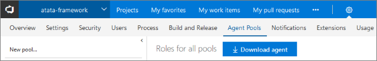
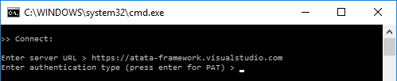
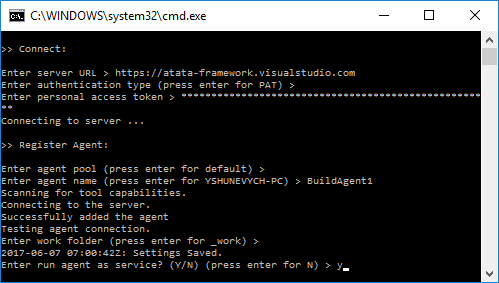
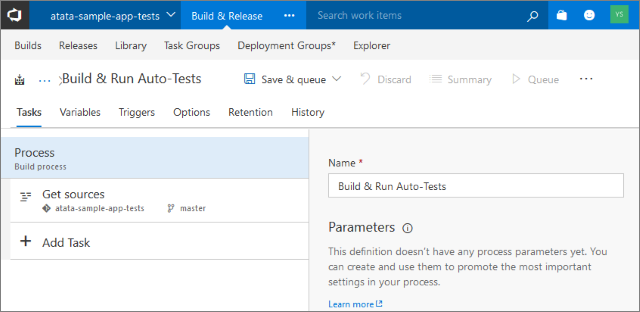
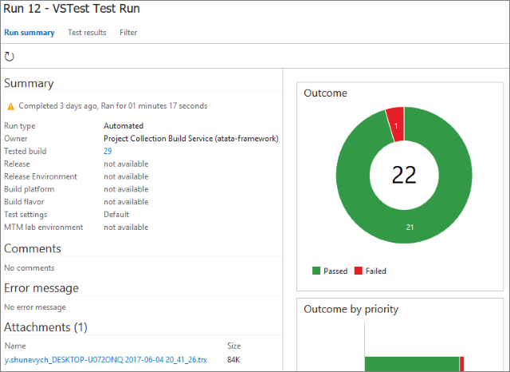
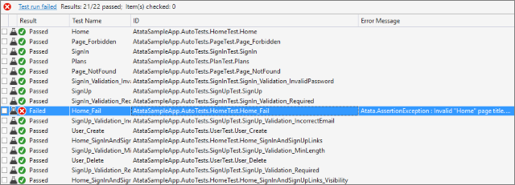
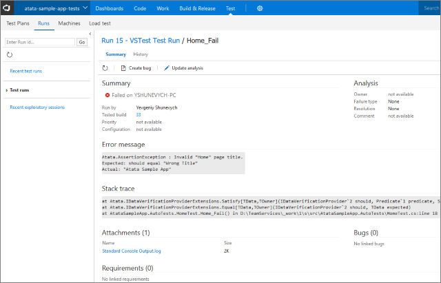
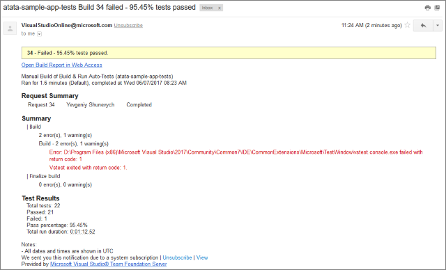

{{ page.description }}
{:.lead}

## Introduction

In this tutorial, I would like to show the way how to configure the Visual Studio Team Services to build and run Atata UI tests using any browser (for Windows platform).
I will also show how to view Atata execution log and failed test details.

*You may also use this artcile as an instruction even for pure WebDriver .NET test automation, as it mostly describes VS Team Servcies configuration.*

## Video Guide



## Prepare Team Services Project

Let's assume that we have a VS Team Services account with some auto-tests hosted in sources.
For testing purposes I used tests from [atata-framework/atata-sample-app-tests](https://github.com/atata-framework/atata-sample-app-tests) repository.

How to sign up for Visual Studio Team Services: [Create your VSTS account with a personal Microsoft account or a work/school/organization account](https://docs.microsoft.com/en-us/vsts/accounts/create-account-msa-or-work-student).

## Create Build Agent

If PhantomJS driver is good for you, you may navigate to "Create Build" section (and skip 9th point), as custom build agent is not required in this case.
Otherwise you will need a machine for custom build agent with installed browser(s).

### Prepare Build Machine

1. It is needed to have Visual Studio installed on the server machine.
1. Install needed browser(s) (e.g. Google Chrome).

### Prepare Account Permissions

You can find the complete documentation on permissions configuration here:
[Prepare permissions](https://docs.microsoft.com/en-us/vsts/build-release/actions/agents/prepare-permissions).
Create personal access token and copy it.

### Configure Build Agent

The process of configuration is described here:
[Download and configure the agent](https://docs.microsoft.com/en-us/vsts/build-release/actions/agents/v2-windows#download-and-configure-the-agent).
But I will try to describe it for our needs shortly.

1. Go to `https://{your-account}.visualstudio.com/_admin/_AgentPool` ("Account settings/Agent Pools") and click "Download agent" button.
   {:.block}
1. Unzip the package to the folder where it will run (e.g. `D:\TeamServices`) and run `config.cmd` as **administrator**.
1. Enter server/account URL: `https://{your-account}.visualstudio.com`.
1. Press Enter to use PAT authentication.<br>
   {:.block}
1. Insert copied personal access token and press Enter.
1. Press enter to use the default agent pool.
1. Enter agent name build, e.g. BuildAgent1.
1. Press enter to use the default work folder name (_work) or specify another.
1. Enter Y and press Enter to run agent as a service.
   {:.block}
1. Press Enter to use the default service account or specify another.

The build agent is created and run as a service.
You can go to `https://{your-account}.visualstudio.com/_admin/_AgentPool` to check the agent.

## Create Build

1. Navigate to projects page `https://{your-account}.visualstudio.com/_projects` and select the project.
1. Using top menu navigate to "Build & Release/Builds".
1. Click "New" button.
1. Select "empty process" on top.
1. Specify name (e.g. "Build & Run Auto-Tests").
   {:.block}
1. Add "NuGet Restore" task.
1. Add "Visual Studio Build" task. You can change "Visual Studio Version" for appropriate.
1. Add "Visual Studio Test" task.
1. Select "Options" tab and change "Default agent queue" drop-down value to "Default".
1. You may also enable the triggers on "Triggers" tab to run the build on commits.
1. Click on top "Save & queue/Save & queue" to add a build to a queue or just "Save & queue/Save".
1. Using top menu navigate to "Build & Release/Builds" and then switch to "All Definitions".
1. Click on your newly created build (e.g. "Build & Run Auto-Tests").
1. Click "Queue new build..." button and then "OK" on popup.

## View Test Results

After the build is finished you can check the test results.

1. Using top menu navigate to "Test/Runs".
1. Click the test run and verify the results.
   {:.block}
1. In "Attachments" section there should be TRX file added.
   You can click it and open with Visual Studio to see detailed (with Atata log output) test results.
   {:.block}
1. In "Test Results" tab you can find successful and failed tests.
   To see failed test details, click it and you'll see "Error Message", "Stack trace" and "Attachments (1)" sections.
   {:.block}
   There is an Atata log in Attachments, it is named "Standard Console Output.log".
   Click, and open it using text editor application (better Notepad++ or Visual Studio, as regular Notepad can open the file without line breaks).
   If you use screenshots, in the log you will see the screenshot file paths (it is path of the file on build agent machine).
1. Team Services, after the build is completed, also send build results letter with such content:
   {:.block}

Here is the sample of the failed test log:

```
2017-06-07 10:32:40.0804 INFO Starting test: Home_Fail
2017-06-07 10:32:40.0819 INFO Init WebDriver
2017-06-07 10:32:42.7913 INFO Go to "Home" page
2017-06-07 10:32:42.7938 INFO Go to URL "http://atata-framework.github.io/atata-sample-app/#!/"
2017-06-07 10:32:46.1065 INFO Verify title should equal "Atata Sample App"
2017-06-07 10:32:46.1570 INFO Verify "Atata Sample App" <h1> heading content should equal "Atata Sample App"
2017-06-07 10:32:46.3101 INFO Verify content should contain "Lorem ipsum"
2017-06-07 10:32:46.3627 INFO Verify title should equal "Wrong Title"
2017-06-07 10:32:56.5635 ERROR Atata.AssertionException : Invalid "Home" page title.
Expected: should equal "Wrong Title"
Actual: "Atata Sample App"

   at Atata.IDataVerificationProviderExtensions.Satisfy[TData,TOwner](IDataVerificationProvider`2 should, Predicate`1 predicate, String message, TData[] args)
   at Atata.IDataVerificationProviderExtensions.Equal[TData,TOwner](IDataVerificationProvider`2 should, TData expected)
   at AtataSampleApp.AutoTests.HomeTest.Home_Fail() in D:\TeamServices\_work\1\s\src\AtataSampleApp.AutoTests\HomeTest.cs:line 18
2017-06-07 10:32:56.5640 INFO Take screenshot #01 - Failed
2017-06-07 10:32:56.6390 INFO Screenshot saved to file "D:\TeamServices\_work\1\s\src\AtataSampleApp.AutoTests\bin\Debug\Logs\2017-06-07 10_32_29\Home_Fail\01 - Home page - Failed.png"
2017-06-07 10:32:56.6395 INFO Clean up test context
2017-06-07 10:32:56.7101 INFO Finished test (16.629s)
2017-06-07 10:32:56.7101 INFO Pure test execution time: 13.848s
```

Using the screenshot file path you can easily open the screenshot on build machine.